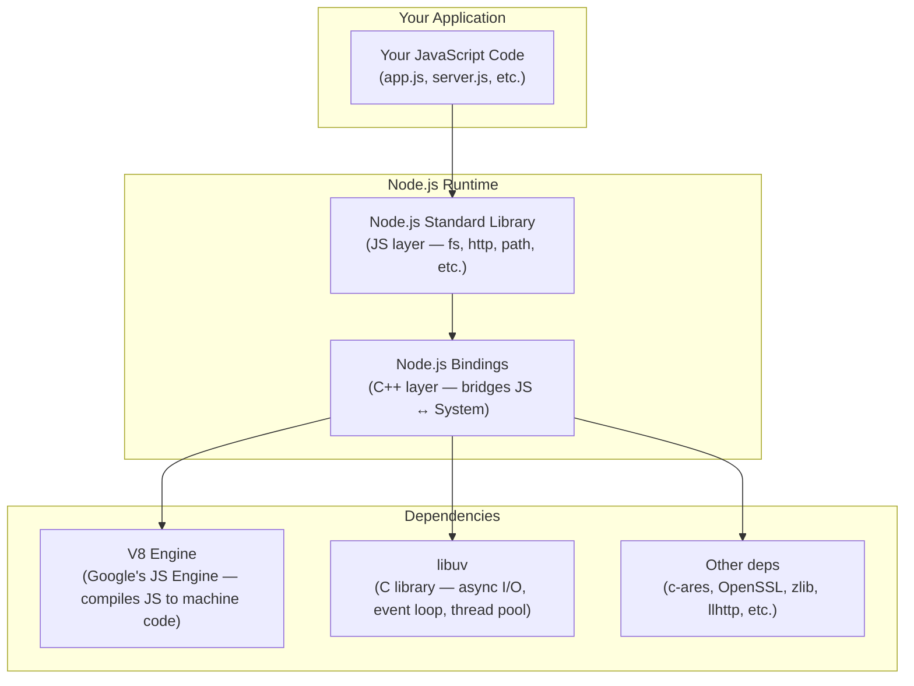

<div align="center">

|                                           ← Previous                                            | [⬆ Back to TOC](../README.md#part-2) |                                       Next →                                       |
| :---------------------------------------------------------------------------------------------: | :----------------------------------: | :--------------------------------------------------------------------------------: |
| [Chapter 4: module.exports & require](../S1%2004%20-%20module.export%20%26%20require/Readme.md) |                                      | [Chapter 6: libuv & async IO](../S1%2006%20-%20libuv%20%26%20async%20IO/Readme.md) |

</div>

---

# Chapter 5 — Diving into the Node.js GitHub Repo &nbsp;

> **Season 1** | Part II — Node.js Architecture & Internals
> [🎬Link](https://namastedev.com/learn/namaste-node/diving-into-the-nodejs-github-repo)

---

<a id="key-topics"></a>

### Topics Covering

> 1. [Why Explore the Node.js Source Code?](#topic-1)
> 2. [How Node.js is Built — Architecture Overview & Execution Flow](#topic-2)
> 3. [The Node.js GitHub Repository Structure & Key Directories](#topic-3)
> 4. [Tracing a Module: From `require("fs")` to C++ Layer](#topic-4)
> 5. [V8 — The JavaScript Engine](#topic-5)
> 6. [libuv — The Async I/O Engine](#topic-6)
> 7. [Node.js C++ Bindings — The Glue Layer](#topic-7)

---

<a id="topic-1"></a>

## 1. [Why Explore the Node.js Source Code?](#key-topics)

Node.js is **open source** — its entire codebase lives on GitHub at [github.com/nodejs/node](https://github.com/nodejs/node). Understanding the repo structure helps you:

- See **how Node.js actually works** under the hood — not just what the docs say
- Understand why certain APIs behave the way they do
- Trace a function from your JavaScript code all the way down to the C/C++ implementation
- Contribute to Node.js or debug issues at a deeper level

> 💡 Reading source code is one of the best ways to become a stronger developer. Node.js is a great starting point because it bridges JavaScript (a language you know) with C/C++ (the systems layer).

<a id="topic-2"></a>

## 2. [How Node.js is Built — Architecture Overview & Execution Flow](#key-topics)

Node.js is **not** a language or a framework — it's a **runtime environment** that lets you run JavaScript outside the browser. It's built by combining several powerful components:



#### The Core Components

| Component                    | Language   | What It Does                                                                                                                                                                      |
| ---------------------------- | ---------- | --------------------------------------------------------------------------------------------------------------------------------------------------------------------------------- |
| **V8**                       | C++        | Google's JavaScript engine (same one in Chrome). Parses and compiles JavaScript into machine code. Handles memory management (garbage collection).                                |
| **libuv**                    | C          | Provides the **event loop**, **async I/O**, **thread pool**, **timers**, and cross-platform system operations (file system, networking, child processes).                         |
| **Node.js Bindings**         | C++        | The "glue" layer that connects JavaScript functions to C/C++ system calls. When you call `fs.readFile()` in JS, bindings translate that into actual system-level file operations. |
| **Node.js Standard Library** | JavaScript | The built-in modules you use every day — `fs`, `http`, `path`, `events`, `stream`, `crypto`, etc. These are written in JavaScript and call into the C++ bindings.                 |
| **c-ares**                   | C          | Asynchronous DNS resolution                                                                                                                                                       |
| **OpenSSL**                  | C          | TLS/SSL encryption for HTTPS, crypto operations                                                                                                                                   |
| **zlib**                     | C          | Compression/decompression (gzip, deflate)                                                                                                                                         |
| **llhttp**                   | C          | HTTP request/response parser                                                                                                                                                      |

#### How a Simple `fs.readFile()` Call Flows Through the Architecture

```
Your Code (JS)           Node.js Std Lib (JS)        Bindings (C++)           libuv (C)              OS
─────────────            ────────────────────        ───────────────          ─────────              ────
fs.readFile()  ──→  lib/fs.js  ──→  src/node_file.cc  ──→  uv_fs_read()  ──→  System Call
                                                                                   │
                                                                                   ↓
                                                                            File data read
                                                                                   │
callback(data) ←── ← ← ← ← ← ← ← ← ← ← ← ← ← ← ← ← ← ← ← ← ← ← ← ← ← ← ←┘
```

> 💡 This is why Node.js is so fast — your JavaScript never directly touches the OS. V8 compiles it to machine code, and libuv handles all the I/O asynchronously so your code doesn't block.

<a id="topic-3"></a>

## 3. [The Node.js GitHub Repository Structure & Key Directories](#key-topics)

The Node.js repo ([github.com/nodejs/node](https://github.com/nodejs/node)) is organized into clear directories. Here are the most important ones:

```
nodejs/node/
├── lib/                  ← JavaScript built-in modules (the code YOU interact with)
│   ├── fs.js             ← File system module
│   ├── http.js           ← HTTP module
│   ├── path.js           ← Path utilities
│   ├── events.js         ← EventEmitter
│   ├── stream.js         ← Streams
│   ├── internal/         ← Internal modules (not exposed to users)
│   └── ...
│
├── src/                  ← C++ source code (Node.js bindings layer)
│   ├── node.cc           ← Entry point of Node.js (bootstrapping)
│   ├── node_file.cc      ← C++ bindings for fs module
│   ├── node_http_parser.cc
│   └── ...
│
├── deps/                 ← Third-party dependencies (vendored)
│   ├── v8/               ← Google's V8 JavaScript engine
│   ├── uv/               ← libuv (event loop, async I/O)
│   ├── openssl/          ← TLS/SSL encryption
│   ├── zlib/             ← Compression library
│   ├── llhttp/           ← HTTP parser
│   ├── cares/            ← Async DNS resolution
│   └── ...
│
├── test/                 ← Test suite for Node.js
├── doc/                  ← Documentation and API docs
├── tools/                ← Build tools and scripts
├── benchmark/            ← Performance benchmarks
└── Makefile / vcbuild.bat ← Build scripts (Linux/macOS / Windows)
```

#### Key Directories Explained

| Directory           | What's Inside                                                           | Why It Matters                                                                                                                                 |
| ------------------- | ----------------------------------------------------------------------- | ---------------------------------------------------------------------------------------------------------------------------------------------- |
| **`lib/`**          | JavaScript source for all built-in modules (`fs`, `http`, `path`, etc.) | This is the code that runs when you call `require("fs")`. You can read these files to understand exactly what any built-in function does.      |
| **`lib/internal/`** | Internal modules used by Node.js itself                                 | Not exposed to users via `require()`. Used by `lib/` modules internally. Prefixed with `internal/` to prevent accidental access.               |
| **`src/`**          | C++ source code — Node.js bindings                                      | Bridges the gap between JavaScript and the operating system. When `lib/fs.js` needs to actually read a file, it calls into `src/node_file.cc`. |
| **`deps/v8/`**      | Google's V8 engine source                                               | The engine that compiles and executes your JavaScript. Node.js vendors (includes) a specific version of V8.                                    |
| **`deps/uv/`**      | libuv source code                                                       | Provides the event loop, async I/O, thread pool, timers, and cross-platform abstractions. This is the heart of Node.js's non-blocking model.   |
| **`deps/openssl/`** | OpenSSL library                                                         | Handles all cryptographic operations — HTTPS, TLS, `crypto` module functionality.                                                              |
| **`test/`**         | Thousands of test files                                                 | Node.js has an extensive test suite. Great for understanding expected behavior of any API.                                                     |

<a id="topic-4"></a>

## 4. [Tracing a Module: From `require("fs")` to C++ Layer](#key-topics)

When you write `const fs = require("fs")`, here's exactly what happens in the repo:

```
1. require("fs")
   └─→ Node.js recognizes "fs" as a core module

2. Loads: lib/fs.js
   └─→ This is the JavaScript API you interact with
   └─→ Contains functions like readFile(), writeFile(), etc.

3. lib/fs.js internally calls C++ bindings
   └─→ Uses internalBinding('fs') to access src/node_file.cc

4. src/node_file.cc calls libuv
   └─→ Calls uv_fs_read(), uv_fs_write(), etc.

5. libuv (deps/uv/) makes the actual OS system call
   └─→ Interacts with the operating system kernel
   └─→ Returns result asynchronously via the event loop
```

> 💡 **This is the key insight:** Every built-in module follows this pattern — **JS layer** (`lib/`) → **C++ bindings** (`src/`) → **libuv/V8** (`deps/`). Understanding this flow helps you debug and reason about Node.js at a much deeper level.

<a id="topic-5"></a>

## 5. [V8 — The JavaScript Engine](#key-topics)

V8 is an open-source **JavaScript and WebAssembly engine** developed by Google. It's the same engine that powers **Google Chrome**.

#### What V8 Does

- **Parses** JavaScript source code into an Abstract Syntax Tree (AST)
- **Compiles** JavaScript directly to **machine code** (not bytecode like older engines)
- **Optimizes** hot code paths using its TurboFan optimizing compiler
- **Manages memory** with an efficient garbage collector
- **Provides** the JavaScript runtime — objects, functions, prototypes, closures, etc.

#### Key Facts About V8

| Aspect                 | Detail                                                                   |
| ---------------------- | ------------------------------------------------------------------------ |
| **Written in**         | C++                                                                      |
| **Created by**         | Google (for Chrome)                                                      |
| **Location in repo**   | `deps/v8/`                                                               |
| **Compilation**        | JIT (Just-In-Time) — compiles JS to machine code at runtime              |
| **Garbage Collection** | Generational — uses Scavenger (young gen) + Mark-Sweep-Compact (old gen) |
| **Key feature**        | Ignition (interpreter) + TurboFan (optimizing compiler) pipeline         |

> 💡 V8 is what makes JavaScript fast. Without V8, Node.js would need a separate interpreter. The fact that V8 compiles JS to machine code (not interpreted line-by-line) is why Node.js can compete with languages like Java and Go for server-side performance.

<a id="topic-6"></a>

## 6. [libuv — The Async I/O Engine](#key-topics)

libuv is a **cross-platform C library** that provides Node.js with its **event loop**, **asynchronous I/O**, and **thread pool**. It was originally written specifically for Node.js.

#### What libuv Provides

| Feature              | What It Does                                                                       |
| -------------------- | ---------------------------------------------------------------------------------- |
| **Event Loop**       | The core mechanism that processes callbacks and keeps Node.js running              |
| **Async File I/O**   | Non-blocking file system operations (read, write, stat, etc.)                      |
| **Async Networking** | TCP/UDP sockets, DNS resolution                                                    |
| **Thread Pool**      | 4 threads (default) for operations that can't be truly async (e.g., file I/O, DNS) |
| **Timers**           | `setTimeout`, `setInterval`, `setImmediate` implementations                        |
| **Child Processes**  | Spawning and managing child processes                                              |
| **Cross-platform**   | Abstracts OS differences (Windows IOCP, Linux epoll, macOS kqueue)                 |

#### Key Facts About libuv

| Aspect                       | Detail                                                                   |
| ---------------------------- | ------------------------------------------------------------------------ |
| **Written in**               | C                                                                        |
| **Created for**              | Node.js (now used by other projects too — Julia, Luvit, etc.)            |
| **Location in repo**         | `deps/uv/`                                                               |
| **Default Thread Pool Size** | 4 threads (configurable via `UV_THREADPOOL_SIZE` env variable, max 1024) |
| **Event Loop Model**         | Single-threaded event loop + multi-threaded pool for blocking ops        |

> 💡 libuv is what makes Node.js **non-blocking**. JavaScript itself is single-threaded, but libuv uses OS-level async primitives and a thread pool behind the scenes, so your code never has to wait for I/O.

<a id="topic-7"></a>

## 7. [Node.js C++ Bindings — The Glue Layer](#key-topics)

The bindings layer (`src/` directory) is written in **C++** and serves as the bridge between your JavaScript code and the C/C++ libraries (V8, libuv).

```
JavaScript World                     C++ World
──────────────                       ──────────

fs.readFile()  ──────────────→  node_file.cc  ──→  uv_fs_read()
http.createServer()  ─────────→  node_http.cc  ──→  uv_tcp_bind()
crypto.createHash()  ─────────→  node_crypto.cc ──→  OpenSSL EVP_*
```

#### How Bindings Work

1. **V8 API** — Node.js uses V8's C++ API to create JavaScript functions that are backed by C++ implementations
2. **`internalBinding()`** — Internal Node.js function that loads C++ modules into the JS layer
3. **`process.binding()`** — Older (deprecated) way to access bindings — you might see this in older code

```javascript
// Inside lib/fs.js (simplified)
const binding = internalBinding("fs"); // Loads src/node_file.cc

function readFile(path, callback) {
  // ... validation ...
  binding.read(fd, buffer, offset, length, position, callback);
  // This calls the C++ Read() function in node_file.cc
}
```

> 💡 You never call bindings directly in your code — the `lib/` modules do it for you. But knowing this layer exists helps you understand **why** Node.js can do things that pure JavaScript can't (like reading files or opening network sockets).

### Common Mistakes

| Mistake                                                   | Why It's Wrong                                                                                                                                                              |
| --------------------------------------------------------- | --------------------------------------------------------------------------------------------------------------------------------------------------------------------------- |
| "Node.js is a programming language"                       | ❌ Node.js is a **runtime environment**. The language is JavaScript. Node.js = V8 + libuv + bindings + standard library.                                                    |
| "Node.js is written in JavaScript"                        | ❌ Node.js is primarily written in **C++ and C** (V8, libuv, bindings). Only the standard library (`lib/`) is JavaScript.                                                   |
| "V8 interprets JavaScript line by line"                   | ❌ V8 **compiles** JavaScript to machine code using JIT (Just-In-Time) compilation, not interpretation.                                                                     |
| "Node.js is single-threaded so it can't do parallel work" | ❌ The **event loop** is single-threaded, but libuv's **thread pool** (4 threads by default) handles blocking operations in parallel.                                       |
| "libuv is part of V8"                                     | ❌ V8 and libuv are completely **separate** projects. V8 handles JavaScript execution; libuv handles async I/O and the event loop.                                          |
| "`lib/` and `src/` contain the same code"                 | ❌ `lib/` contains **JavaScript** (the API you use). `src/` contains **C++** (the bindings that call system-level operations). They work together but are different layers. |

<div style="font-size: 22px; color: red">
<details>
  <summary><strong>Interview Questions (Click to View)</strong></summary>
  <div style="font-size: 0.9rem; color: black; background:#fff; border:2px solid red; border-radius: 10px;">

- **Q: What is Node.js? Is it a language or a framework?**
  - A: Node.js is neither a language nor a framework — it's a **runtime environment** for executing JavaScript outside the browser. It combines Google's V8 engine (for JS execution), libuv (for async I/O and the event loop), C++ bindings (glue layer), and a JavaScript standard library (`fs`, `http`, `path`, etc.).

- **Q: What are the main components of Node.js architecture?**
  - A: Node.js has four main layers: (1) The **JavaScript Standard Library** (`lib/`) — built-in modules written in JS, (2) **Node.js Bindings** (`src/`) — C++ code that bridges JS and system calls, (3) **V8** — Google's JS engine that compiles JS to machine code, and (4) **libuv** — C library providing the event loop, async I/O, and thread pool.

- **Q: What is V8 and what role does it play in Node.js?**
  - A: V8 is Google's open-source JavaScript engine, written in C++. It parses JavaScript, compiles it to machine code using JIT compilation (Ignition + TurboFan pipeline), and manages memory with a generational garbage collector. Node.js uses V8 to execute all JavaScript code.

- **Q: What is libuv and why does Node.js need it?**
  - A: libuv is a cross-platform C library that provides the event loop, asynchronous I/O operations, a thread pool, timers, and cross-platform abstractions. Node.js needs it because V8 only handles JavaScript execution — it has no concept of file systems, networking, or async I/O. libuv fills that gap.

- **Q: What is the `lib/` directory in the Node.js repo?**
  - A: The `lib/` directory contains the JavaScript source code for all built-in modules (`fs`, `http`, `path`, `events`, etc.). When you call `require("fs")`, Node.js loads the code from `lib/fs.js`. These modules are written in JavaScript and internally call C++ bindings for system-level operations.

- **Q: What is the `src/` directory in the Node.js repo?**
  - A: The `src/` directory contains C++ source code that forms the bindings layer. It bridges JavaScript functions to actual system calls. For example, `src/node_file.cc` provides the C++ implementation for file system operations that `lib/fs.js` calls into.

- **Q: How does a call like `fs.readFile()` flow through Node.js internally?**
  - A: `fs.readFile()` in your code → `lib/fs.js` (JS standard library) → `internalBinding('fs')` loads `src/node_file.cc` (C++ bindings) → calls `uv_fs_read()` in libuv → libuv makes the OS system call → result returns via the event loop → your callback is invoked.

- **Q: What is the `deps/` directory in the Node.js repo?**
  - A: The `deps/` directory contains vendored (included) third-party dependencies: `v8/` (JS engine), `uv/` (libuv for async I/O), `openssl/` (TLS/crypto), `zlib/` (compression), `llhttp/` (HTTP parser), and `cares/` (async DNS). These are external projects that Node.js bundles.

- **Q: What is `internalBinding()` in Node.js?**
  - A: `internalBinding()` is an internal Node.js function used by `lib/` modules to load C++ bindings from the `src/` directory. For example, `internalBinding('fs')` loads the C++ file system bindings. It's not available to user code — only used internally by Node.js built-in modules.

    </div>
  </details>
  </div>

### Key Takeaways

- Node.js is a **runtime environment**, not a language — it's built with **V8** (JS engine), **libuv** (async I/O), **C++ bindings**, and a **JS standard library**
- The Node.js source code is open source at [github.com/nodejs/node](https://github.com/nodejs/node)
- **`lib/`** contains JavaScript built-in modules (the API you use — `fs`, `http`, `path`)
- **`src/`** contains C++ bindings (bridges JS calls to system-level operations)
- **`deps/`** contains vendored dependencies — V8, libuv, OpenSSL, zlib, llhttp, c-ares
- **V8** compiles JavaScript to machine code via JIT compilation — it doesn't interpret line-by-line
- **libuv** provides the event loop, async I/O, thread pool (4 threads default), and cross-platform abstractions
- Every built-in module follows the flow: **JS layer** (`lib/`) → **C++ bindings** (`src/`) → **libuv/V8** (`deps/`)
- `internalBinding()` is how `lib/` modules access C++ implementations in `src/`
- Understanding this architecture helps you debug, optimize, and reason about Node.js at a deeper level

---

<div align="center">

|                                           ← Previous                                            | [⬆ Back to TOC](../README.md#part-2) |                                       Next →                                       |
| :---------------------------------------------------------------------------------------------: | :----------------------------------: | :--------------------------------------------------------------------------------: |
| [Chapter 4: module.exports & require](../S1%2004%20-%20module.export%20%26%20require/Readme.md) |                                      | [Chapter 6: libuv & async IO](../S1%2006%20-%20libuv%20%26%20async%20IO/Readme.md) |

</div>
