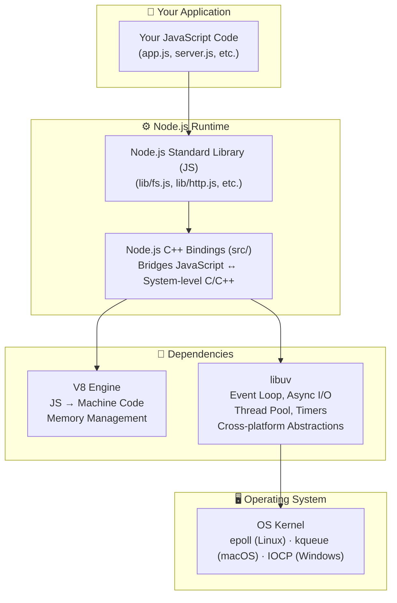

<div align="center">

|                                           ← Previous                                           | [📑 Table of Contents](../README.md#part-2) |                                                         Next →                                                         |
| :--------------------------------------------------------------------------------------------: | :-----------------------------------------: | :--------------------------------------------------------------------------------------------------------------------: |
| [Chapter 5: Diving into NodeJs Repo](../S1%2005%20-%20Diving%20into%20NodeJs%20Repo/Readme.md) |                                             | [Chapter 7: sync, async, setTimeout Zero-Code](../S1%2007%20-%20sync%2C%20async%2C%20setTimeout%20Zero-Code/Readme.md) |

</div>

---

# Chapter 6 — libuv & Async IO &nbsp;

> **Season 1** | Part II — Node.js Architecture & Internals
> [🎬Link](https://namastedev.com/learn/namaste-node/libuv-async-io)

---

<a id="key-topics"></a>

### Topics Covering

> 1. [What is libuv & Where It Fits in Node.js Architecture](#topic-1)
> 2. [What libuv Provides](#topic-2)
> 3. [Synchronous vs Asynchronous — The Core Concept](#topic-3)
> 4. [Blocking vs Non-Blocking I/O](#topic-4)
> 5. [How libuv Handles Async Operations (OS Primitives vs Thread Pool)](#topic-5)
> 6. [Event-Driven Architecture & Event Loop Overview](#topic-6)
> 7. [Code Examples: Sync vs Async, Event-Driven Server & Event Loop](#topic-7)

---

<a id="topic-1"></a>

## 1. [What is libuv & Where It Fits in Node.js Architecture](#key-topics)

**libuv** is a cross-platform **C library** that provides Node.js with its **event loop**, **asynchronous I/O**, **thread pool**, and **cross-platform abstractions**. It was originally written by **Ben Noordhuis** specifically for Node.js, but is now used by other projects (Julia, Luvit, Neovim, etc.).

libuv doesn't perform the actual I/O tasks itself — it **manages and delegates** operations to the operating system's async primitives or its own thread pool, and notifies your JavaScript code via callbacks when operations complete.

> 💡 **V8** handles JavaScript execution. **libuv** handles everything else — file system, networking, timers, DNS, child processes, and the event loop. Together, they make Node.js work.

### Where libuv Fits in the Node.js Architecture



<a id="topic-2"></a>

## 2. [What libuv Provides](#key-topics)

| Feature              | What It Does                                                                                            |
| -------------------- | ------------------------------------------------------------------------------------------------------- |
| **Event Loop**       | The core mechanism that processes callbacks, keeps Node.js alive, and orchestrates all async operations |
| **Async File I/O**   | Non-blocking file read/write/stat using the thread pool                                                 |
| **Async Networking** | TCP/UDP sockets, pipes — uses OS-level async primitives (truly non-blocking)                            |
| **DNS Resolution**   | Async DNS lookups (`dns.lookup` uses thread pool, `dns.resolve` uses c-ares)                            |
| **Thread Pool**      | 4 worker threads (default) for operations that have no OS-level async support                           |
| **Timers**           | `setTimeout`, `setInterval`, `setImmediate` implementations                                             |
| **Child Processes**  | Spawning and managing child processes                                                                   |
| **Signal Handling**  | Cross-platform signal handling (SIGINT, SIGTERM, etc.)                                                  |
| **Cross-platform**   | Abstracts OS differences — one API for Windows, Linux, macOS                                            |

<a id="topic-3"></a>

## 3. [Synchronous vs Asynchronous — The Core Concept](#key-topics)

##### Synchronous (Blocking)

In synchronous programming, operations execute **one after another, in sequence**. Each line waits for the previous one to finish before proceeding. The thread is **blocked** during I/O operations — it sits idle waiting.

```
Synchronous Execution:
──────────────────────────────────────
Task 1: Read file     [████████████]          ← Thread BLOCKED (waiting)
Task 2: Query DB                    [████████] ← Can't start until Task 1 finishes
Task 3: Send response                        [███]
                      ─────────────────────────────→ time
Total: Sum of all task durations
```

##### Asynchronous (Non-Blocking)

In asynchronous programming, operations are **initiated and delegated** — the thread doesn't wait. While waiting for I/O, other tasks can proceed. When the I/O completes, a callback is invoked.

```
Asynchronous Execution:
──────────────────────────────────────
Task 1: Read file     [██]→delegate→         [callback]
Task 2: Query DB        [██]→delegate→     [callback]
Task 3: Console.log       [█]
                      ─────────────────────────────→ time
Total: Much shorter! Tasks overlap.
```

| Aspect              | Synchronous (Blocking)         | Asynchronous (Non-Blocking)        |
| ------------------- | ------------------------------ | ---------------------------------- |
| **Execution**       | Sequential — one at a time     | Concurrent — tasks overlap         |
| **Thread behavior** | Blocks/waits during I/O        | Delegates I/O, continues execution |
| **Performance**     | Slow for I/O-heavy tasks       | Fast — I/O runs in background      |
| **Code complexity** | Simple, linear flow            | Callbacks, Promises, async/await   |
| **Use case**        | Simple scripts, startup config | Servers, APIs, real-time apps      |
| **Node.js API**     | `fs.readFileSync()`            | `fs.readFile()`                    |

<a id="topic-4"></a>

## 4. [Blocking vs Non-Blocking I/O](#key-topics)

**I/O** (Input/Output) refers to operations that interact with systems **outside your program** — file system, network, database, terminal, etc. These are inherently slow compared to CPU operations.

| I/O Type           | Speed               | Example                                 |
| ------------------ | ------------------- | --------------------------------------- |
| **CPU operations** | Nanoseconds         | `2 + 3`, `array.sort()`, `JSON.parse()` |
| **Memory (RAM)**   | ~100 nanoseconds    | Variable access, object lookups         |
| **Disk (SSD)**     | ~100 microseconds   | `fs.readFile()`, database queries       |
| **Network**        | ~1–100 milliseconds | HTTP requests, API calls, DNS lookups   |

> 💡 A network request can be **1 million times slower** than a CPU operation. This is why blocking I/O is devastating for servers — the thread sits idle for ages while waiting.

##### Blocking I/O — The Problem

```javascript
const fs = require("fs");

console.log("1 — Start");

// ❌ BLOCKING — the entire thread freezes here until the file is fully read
const data = fs.readFileSync("./large-file.txt", "utf-8");
console.log("2 — File read complete, size:", data.length);

console.log("3 — End");
```

```
Output (always in this order):
1 — Start
2 — File read complete, size: 1048576
3 — End

Timeline:
[Start] ████████████████████ [File read — BLOCKED] ████ [End]
Nothing else can happen during the file read!
```

##### Non-Blocking I/O — The Solution

```javascript
const fs = require("fs");

console.log("1 — Start");

// ✅ NON-BLOCKING — delegates to libuv, continues immediately
fs.readFile("./large-file.txt", "utf-8", (err, data) => {
  if (err) throw err;
  console.log("2 — File read complete, size:", data.length);
});

console.log("3 — End");
```

```
Output (note the order!):
1 — Start
3 — End
2 — File read complete, size: 1048576

Timeline:
[Start] [End] .......... [File read callback]
              ↑
              Didn't wait! Other code ran while file was being read.
```

> ⚠️ Notice **"3 — End"** prints before **"2 — File read complete"**. This is the essence of non-blocking I/O — Node.js doesn't wait. It delegates the file read to libuv and moves on.

<a id="topic-5"></a>

## 5. [How libuv Handles Async Operations (OS Primitives vs Thread Pool)](#key-topics)

libuv uses **two different mechanisms** depending on the type of operation:

##### 1. OS Async Primitives (for networking)

For **network I/O** (TCP, UDP, pipes), the operating system provides truly asynchronous interfaces. libuv uses these directly:

| OS          | Async Primitive | How It Works                                  |
| ----------- | --------------- | --------------------------------------------- |
| **Linux**   | `epoll`         | Monitors file descriptors for I/O readiness   |
| **macOS**   | `kqueue`        | BSD event notification interface              |
| **Windows** | `IOCP`          | I/O Completion Ports — completion-based model |

```
Network I/O (e.g., HTTP request):
─────────────────────────────────
Your Code → libuv → OS async primitive (epoll/kqueue/IOCP)
                          │
                     OS handles the I/O in the background
                          │
                     Notifies libuv when ready
                          │
                     libuv invokes your callback
```

> 💡 Network operations are the most efficient in Node.js because they use truly non-blocking OS primitives — no thread pool needed.

##### 2. Thread Pool (for file I/O, DNS, crypto)

Some operations **don't have OS-level async support** (notably file system operations on most OS). For these, libuv uses a **thread pool**:

| Operation       | Mechanism           | Why                                                 |
| --------------- | ------------------- | --------------------------------------------------- |
| **Network I/O** | OS async primitives | OS provides true async networking                   |
| **File system** | Thread pool         | Most OS lack true async file I/O                    |
| **DNS lookup**  | Thread pool         | `dns.lookup()` uses `getaddrinfo` (blocking C call) |
| **Crypto**      | Thread pool         | CPU-intensive operations would block the event loop |
| **Zlib**        | Thread pool         | Compression/decompression is CPU-intensive          |

```
File I/O (e.g., fs.readFile):
─────────────────────────────
Your Code → libuv → Thread Pool (worker thread picks it up)
                          │
                     Worker thread performs blocking read
                          │
                     Completes → notifies event loop
                          │
                     Event loop invokes your callback
```

> 💡 The thread pool has **4 threads** by default. You can increase it (up to 1024) with the `UV_THREADPOOL_SIZE` environment variable. Thread pool details are covered in depth in **Chapter 10**.

<a id="topic-6"></a>

## 6. [Event-Driven Architecture & Event Loop Overview](#key-topics)

Node.js follows an **event-driven architecture** — the flow of the program is determined by **events** (I/O completion, timers firing, signals received) rather than sequential instruction execution.

```
Traditional (Imperative):
─────────────────────────
1. Open connection
2. Wait for data          ← Thread blocked!
3. Process data
4. Send response
5. Go back to 1           ← One request at a time

Event-Driven (Node.js):
─────────────────────────
Event Loop running:
  → "New connection" event  → Register callback
  → "Data received" event   → Execute callback
  → "Timer expired" event   → Execute callback
  → "File read done" event  → Execute callback
  → ... (keeps looping until nothing left to do)
```

The core pattern: **register a callback** → **do other things** → **callback fires when event occurs**.

```javascript
const EventEmitter = require("events");
const emitter = new EventEmitter();

// Register a listener (callback) for the "data" event
emitter.on("data", (payload) => {
  console.log("Data received:", payload);
});

// Later, emit the event — the callback fires
emitter.emit("data", { id: 1, name: "Harshit" });
// Output: Data received: { id: 1, name: 'Harshit' }
```

> 💡 The **Event Loop** is the mechanism that orchestrates this entire event-driven model. It continuously checks for pending events and executes their callbacks. The event loop phases are covered in depth in **Chapter 9**.

### The Event Loop — Overview

The event loop is libuv's **core mechanism**. It keeps Node.js running as long as there are pending operations:

```
   ┌───────────────────────────┐
┌─►│         Timers             │  ← setTimeout, setInterval callbacks
│  └─────────────┬─────────────┘
│  ┌─────────────▼─────────────┐
│  │     Pending Callbacks      │  ← I/O callbacks deferred from previous loop
│  └─────────────┬─────────────┘
│  ┌─────────────▼─────────────┐
│  │     Idle, Prepare          │  ← Internal use only
│  └─────────────┬─────────────┘
│  ┌─────────────▼─────────────┐
│  │         Poll               │  ← Retrieve new I/O events; execute I/O callbacks
│  └─────────────┬─────────────┘
│  ┌─────────────▼─────────────┐
│  │         Check              │  ← setImmediate callbacks
│  └─────────────┬─────────────┘
│  ┌─────────────▼─────────────┐
│  │      Close Callbacks       │  ← socket.on('close'), cleanup
│  └─────────────┬─────────────┘
│                │
└────────────────┘  (loops back if there are pending operations)
```

> ⚠️ This is an introductory overview. The **detailed phases, microtask queues, and execution order** are covered in **Chapter 9 — libuv and Event Loop**.

<a id="topic-7"></a>

## 7. [Code Examples: Sync vs Async, Event-Driven Server & Event Loop](#key-topics)

#### Sync vs Async — Side by Side

```javascript
const fs = require("fs");
const crypto = require("crypto");

// ===== SYNCHRONOUS — Everything blocks =====
console.log("=== Sync Demo ===");
console.time("sync-total");

const data1 = fs.readFileSync("./file1.txt", "utf-8"); // Block
console.log("Sync: File 1 read");

const data2 = fs.readFileSync("./file2.txt", "utf-8"); // Block
console.log("Sync: File 2 read");

const hash = crypto.pbkdf2Sync("password", "salt", 100000, 64, "sha512");
console.log("Sync: Hash generated"); // Block

console.timeEnd("sync-total");
// sync-total: ~800ms (all tasks run sequentially)
```

**Output:**

```
=== Sync Demo ===
Sync: File 1 read
Sync: File 2 read
Sync: Hash generated
sync-total: 823ms

```

```javascript
// ===== ASYNCHRONOUS — Tasks overlap =====
console.log("\n=== Async Demo ===");
console.time("async-total");

fs.readFile("./file1.txt", "utf-8", (err, data) => {
  console.log("Async: File 1 read");
});

fs.readFile("./file2.txt", "utf-8", (err, data) => {
  console.log("Async: File 2 read");
});

crypto.pbkdf2("password", "salt", 100000, 64, "sha512", (err, key) => {
  console.log("Async: Hash generated");
  console.timeEnd("async-total");
});

console.log("Async: All tasks delegated, moving on!");
// async-total: ~300ms (tasks run concurrently via thread pool!)
```

**Output:**

```
=== Async Demo ===
Async: All tasks delegated, moving on!
Async: File 1 read
Async: File 2 read
Async: Hash generated
async-total: 312ms
```

> 💡 The async version is **~2.5x faster** because all three tasks run concurrently on libuv's thread pool instead of waiting for each other.

#### Event-Driven Server Example

```javascript
const http = require("http");

const server = http.createServer((req, res) => {
  // This callback fires for every "request" event
  console.log(`${req.method} ${req.url}`);
  res.writeHead(200, { "Content-Type": "text/plain" });
  res.end("Hello from event-driven server!");
});

// The server listens for "connection" events — never blocks
server.listen(3000, () => {
  console.log("Server listening on port 3000");
  console.log("This is event-driven — Node.js waits for events, not blocking!");
});
```

#### Proving the Event Loop Keeps Node.js Alive

```javascript
// Node.js exits when there are no more pending operations
console.log("Start");

// This keeps Node.js alive — the event loop has a pending timer
setTimeout(() => {
  console.log("Timer fired after 2 seconds");
}, 2000);

console.log("End");
// Node.js doesn't exit here — the timer is still pending
// It exits after the timer callback runs
```

```
Output:
Start
End
(2 seconds later...)
Timer fired after 2 seconds
(process exits — nothing more to do)
```

### Common Mistakes

| Mistake                                                   | Why It's Wrong                                                                                                                                       |
| --------------------------------------------------------- | ---------------------------------------------------------------------------------------------------------------------------------------------------- |
| "libuv is part of V8"                                     | ❌ V8 and libuv are completely **separate** projects. V8 handles JS execution; libuv handles async I/O and the event loop                            |
| "Node.js is single-threaded so it can't do parallel work" | ❌ The **event loop** is single-threaded, but libuv's **thread pool** handles blocking ops in parallel (4 threads by default)                        |
| "All async operations use the thread pool"                | ❌ **Network I/O** uses OS async primitives (epoll/kqueue/IOCP) — no thread pool. Only file I/O, DNS, crypto, zlib use it                            |
| "Synchronous and asynchronous produce different results"  | ❌ Both produce the **same result** — the difference is in **when** and **how** the result is delivered                                              |
| "libuv does the actual I/O work"                          | ❌ libuv **manages and delegates** I/O operations. The OS kernel or thread pool workers perform the actual work                                      |
| "Blocking code is always bad"                             | ❌ Synchronous code is fine for startup/config. It's **only a problem** in hot paths (request handlers, loops, event callbacks)                      |
| "`readFile` is always faster than `readFileSync`"         | ❌ For a **single** file read, sync may be marginally faster (no callback overhead). Async wins when you have **multiple concurrent** I/O operations |

<div style="font-size: 22px; color: red">
<details>
  <summary><strong>Interview Questions (Click to View)</strong></summary>
  <div style="font-size: 0.9rem; color: black; background:#fff; border:2px solid red; border-radius: 10px;">

- **Q: What is libuv and why does Node.js need it?**
  - A: libuv is a cross-platform C library that provides Node.js with its event loop, asynchronous I/O, thread pool, timers, and cross-platform abstractions. Node.js needs it because V8 only handles JavaScript execution — it has no concept of file systems, networking, or async I/O. libuv fills that gap.

- **Q: What is the difference between synchronous and asynchronous programming?**
  - A: **Synchronous** — operations execute sequentially; each line waits for the previous one to finish, blocking the thread. **Asynchronous** — operations are initiated and delegated; the thread continues without waiting, and a callback/promise is invoked when the operation completes.

- **Q: What is blocking vs non-blocking I/O?**
  - A: **Blocking I/O** halts the thread until the I/O operation completes (e.g., `fs.readFileSync`). **Non-blocking I/O** delegates the operation to libuv and continues — a callback is invoked when it finishes (e.g., `fs.readFile`). Non-blocking allows handling multiple I/O operations concurrently.

- **Q: What is event-driven architecture?**
  - A: An architecture where program flow is determined by events (I/O completion, timers, user actions). Instead of waiting sequentially, you register callbacks for events, and the event loop invokes them when events occur. This is the core model of Node.js.

- **Q: How does libuv handle network I/O vs file I/O differently?**
  - A: **Network I/O** uses OS-level async primitives (epoll on Linux, kqueue on macOS, IOCP on Windows) — truly non-blocking, no thread pool needed. **File I/O** uses libuv's thread pool because most operating systems don't provide true async file system APIs.

- **Q: What is the libuv thread pool?**
  - A: A pool of worker threads (4 by default, configurable up to 1024 via `UV_THREADPOOL_SIZE`) used for operations that don't have OS-level async support — file I/O, DNS lookups (`dns.lookup`), crypto, and zlib. The thread pool allows these blocking operations to run without blocking the event loop.

- **Q: What is the event loop?**
  - A: The event loop is libuv's core mechanism that keeps Node.js running. It continuously checks for pending async operations, timers, and callbacks, processing them in phases (Timers → Pending → Idle → Poll → Check → Close). It exits when there are no more pending operations.

- **Q: What are epoll, kqueue, and IOCP?**
  - A: These are OS-level async I/O notification mechanisms. **epoll** (Linux) monitors file descriptors for readiness. **kqueue** (macOS/BSD) is a similar event notification interface. **IOCP** (Windows) uses I/O Completion Ports. libuv abstracts these differences so Node.js code works cross-platform.

- **Q: When should you use synchronous I/O in Node.js?**
  - A: Only during **application startup** (e.g., reading config files, loading certificates) or in **CLI tools** where concurrency isn't needed. Never use sync I/O inside request handlers, event callbacks, or hot loops — it blocks the event loop and kills server performance.

- **Q: Does Node.js exit immediately after the last line of code?**
  - A: No. Node.js exits when the event loop has **no more pending operations** — no active timers, no pending I/O, no listening servers. If you have a `setTimeout` or a listening server, Node.js stays alive until those complete or are closed.

    </div>
  </details>
  </div>

### Key Takeaways

- **libuv** is a C library providing Node.js with async I/O, event loop, thread pool, and cross-platform abstractions
- libuv **manages and delegates** operations — it doesn't perform I/O itself
- **Synchronous** = sequential, blocking, thread waits | **Asynchronous** = concurrent, non-blocking, callback-driven
- **Network I/O** uses OS async primitives (epoll/kqueue/IOCP) — truly non-blocking, no thread pool
- **File I/O, DNS, crypto, zlib** use libuv's **thread pool** (4 threads default) because they lack OS async support
- Node.js follows an **event-driven architecture** — register callbacks → event loop fires them when events occur
- The **event loop** keeps Node.js alive while there are pending operations and exits when there's nothing left
- Async code doesn't produce different results — only **when** and **how** the result arrives differs
- Use sync I/O only at startup; **never block the event loop** in request handlers or callbacks

---

<div align="center">

|                                           ← Previous                                           | [📑 Table of Contents](../README.md#part-2) |                                                         Next →                                                         |
| :--------------------------------------------------------------------------------------------: | :-----------------------------------------: | :--------------------------------------------------------------------------------------------------------------------: |
| [Chapter 5: Diving into NodeJs Repo](../S1%2005%20-%20Diving%20into%20NodeJs%20Repo/Readme.md) |                                             | [Chapter 7: sync, async, setTimeout Zero-Code](../S1%2007%20-%20sync%2C%20async%2C%20setTimeout%20Zero-Code/Readme.md) |

</div>
