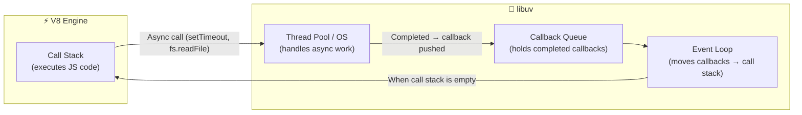
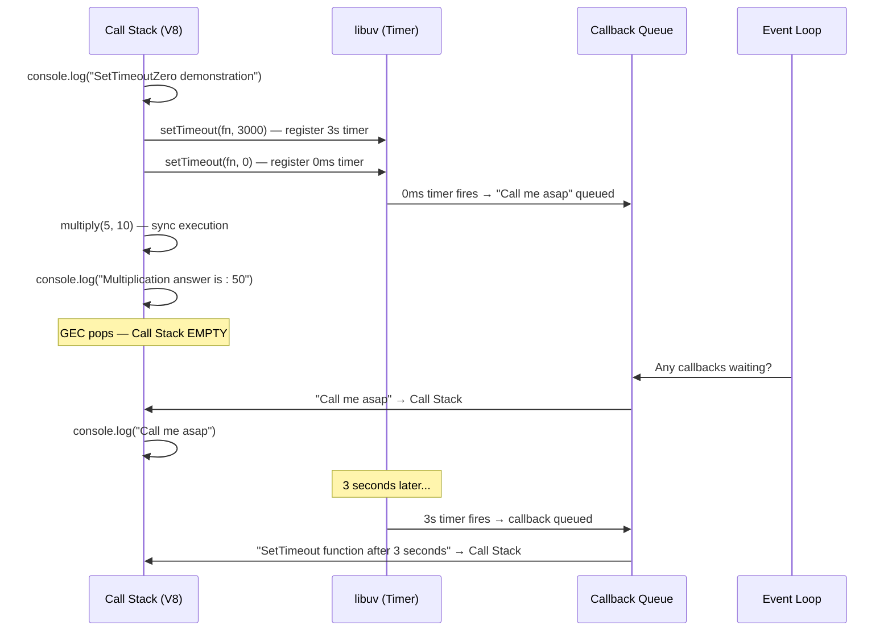

<div align="center">

|                                     ← Previous                                     | [📑 Table of Contents](../README.md#part-2) |                                                   Next →                                                   |
| :--------------------------------------------------------------------------------: | :-----------------------------------------: | :--------------------------------------------------------------------------------------------------------: |
| [Chapter 6: libuv & async IO](../S1%2006%20-%20libuv%20%26%20async%20IO/Readme.md) |                                             | [Chapter 8: Deep dive into v8 JS Engine](../S1%2008%20-%20Deep%20dive%20into%20v8%20JS%20Engine/Readme.md) |

</div>

---

# Chapter 7 — sync, async, setTimeout Zero-Code &nbsp;

> **Season 1** | Part II — Node.js Architecture & Internals
> [🎬Link](https://namastedev.com/learn/namaste-node/sync-async-settimeoutzero-code)

---

<a id="key-topics"></a>

### Topics Covering

> 1. [The Big Picture: V8 Engine vs libuv Roles](#topic-1)
> 2. [Synchronous Code — Call Stack in Action](#topic-2)
> 3. [Blocking Code — `crypto.pbkdf2Sync` vs `crypto.pbkdf2`](#topic-3)
> 4. [Asynchronous Code — V8 + libuv Working Together](#topic-4)
> 5. [`setTimeout(fn, 0)` — The Zero-Delay Trap & Trust Issues](#topic-5)
> 6. [`readFileSync` vs `readFile` — The Common Mistake](#topic-6)
> 7. [Execution Order Prediction & Practice Code Files](#topic-7)

---

### What is This Chapter About?

This chapter dives into the **execution mechanics** of synchronous and asynchronous code in Node.js — specifically how the **call stack**, **V8 engine**, **libuv**, and the **callback queue** work together. The star of this chapter is `setTimeout(fn, 0)` — which reveals that even a 0ms timer doesn’t execute immediately.

> 💡 Understanding this execution flow is one of the **most asked interview topics** in Node.js and JavaScript.

<a id="topic-1"></a>

## 1. [The Big Picture: V8 Engine vs libuv Roles](#key-topics)

When Node.js executes your code, two systems work together:

| Component     | Handles                                                               | Execution Model              |
| ------------- | --------------------------------------------------------------------- | ---------------------------- |
| **V8 Engine** | All JavaScript code — variables, functions, `console.log`             | Synchronous, single-threaded |
| **libuv**     | Async I/O — `setTimeout`, `fs.readFile`, `crypto.pbkdf2`, `https.get` | Asynchronous, event-driven   |



**The Rule:** The event loop only moves callbacks from the queue to the call stack **when the call stack is empty** (all synchronous code has finished).

---

<a id="topic-2"></a>

## 2. [Synchronous Code — Call Stack in Action](#key-topics)

_V8 executes synchronous code using the **call stack** — a LIFO (Last In, First Out) data structure._
_Every line executes **sequentially**. The call stack never has more than **one function executing** at a time (single-threaded)._

> 📁 Practice file: [`sync.js`](./Code/sync.js)

```javascript
// sync.js
console.log("Synchronous Code");

var a = 62656954;
var b = 6256546;

function multiply(a, b) {
  const result = a * b;
  return result;
}
var c = multiply(a, b);
console.log("Multiplication of a and b is " + c);
```

**Output:**

```
Synchronous Code
Multiplication of a and b is 392009646498284
```

<details>
<summary><strong>Click to View Execution Flow: </strong>Step-by-step Call Stack Trace</summary>

```
Step 1: Program starts
  Call Stack: [GEC]                    ← Global Execution Context pushed
  Output: (nothing yet)

Step 2: console.log("Synchronous Code")
  Call Stack: [GEC, console.log()]     ← console.log pushed
  Output: Synchronous Code
  Call Stack: [GEC]                    ← console.log popped

Step 3: var a = 62656954, var b = 6256546
  Call Stack: [GEC]                    ← Variables assigned in GEC

Step 4: multiply(a, b) called
  Call Stack: [GEC, multiply()]        ← multiply EC pushed
  Inside multiply: result = 62656954 * 6256546 = 392009646498284
  return result → c = 392009646498284
  Call Stack: [GEC]                    ← multiply EC popped

Step 5: console.log("Multiplication of a and b is " + c)
  Call Stack: [GEC, console.log()]     ← console.log pushed
  Output: Multiplication of a and b is 392009646498284
  Call Stack: [GEC]                    ← console.log popped

Step 6: Program ends
  Call Stack: []                       ← GEC popped, stack empty
```

</details>

---

<br/>

<a id="topic-3"></a>

## 3. [Blocking Code — `crypto.pbkdf2Sync` vs `crypto.pbkdf2`](#key-topics)

_This example demonstrates how **synchronous crypto** blocks the main thread while **asynchronous crypto** doesn’t:_

> 📁 Practice file: [`blocking.js`](./Code/blocking.js)

```javascript
// blocking.js
const crypto = require("node:crypto");

console.log("Program started");

// pbkdf2 - Password Based Key Derivative Function version-2

// ❌ SYNCHRONOUS — blocks the main thread (no callback)
crypto.pbkdf2Sync("harshit2490", "salt", 5000000, 20, "sha512");
console.log("First synchronous key is generated");

// ✅ ASYNCHRONOUS — delegated to libuv's thread pool
crypto.pbkdf2("harshit2490", "salt", 50000, 20, "sha512", (err, key) => {
  console.log("Below is the asynchronous key of your password");
  console.log(key);
});

function addition(x, y) {
  const result = x + y;
  return result;
}

var c = addition(5, 10);
console.log("Addition is: " + c);
```

**Output:**

```
Program started
First synchronous key is generated        (after several seconds of blocking!)
Addition is: 15
Below is the asynchronous key of your password
<Buffer ...>
```

<details>
<summary><strong>Click to View Execution Flow: </strong>Step-by-step</summary>
```
1. console.log("Program started")         → prints immediately
2. crypto.pbkdf2Sync(...)                  → BLOCKS the thread for several seconds!
   (V8 call stack is frozen — nothing else can run)
3. console.log("First synchronous key...") → prints after pbkdf2Sync finishes
4. crypto.pbkdf2(...)                      → delegates to libuv thread pool, moves on
5. addition(5, 10) runs                    → sync, returns 15
6. console.log("Addition is: 15")          → prints immediately
7. Call stack empty → event loop runs
8. crypto.pbkdf2 callback fires            → prints the async key
```
</details>

> ⚠️ Notice how `pbkdf2Sync` with 5,000,000 iterations **freezes the entire program** for seconds. The async version with 50,000 iterations runs in the background without blocking.

---

<br/>

<a id="topic-4"></a>

## 4. [Asynchronous Code — V8 + libuv Working Together](#key-topics)

_This file mixes **synchronous and asynchronous operations** in one script — the best way to understand execution order:_

> 📁 Practice file: [`async.js`](./Code/async.js)

> 📁 [`file.txt`](./Code/file.txt) contains: `Hi i am a Nodejs Developer`

```javascript
// async.js
const fs = require("fs");
const https = require("https");

console.log("Asynchronous Javascript");

var a = 5;
var b = 10;

// ❌ Synchronous file read — blocks the main thread
fs.readFileSync("./file.txt", "utf8");
console.log("This will execute only after reading the file");

// ✅ Async HTTPS request — delegated to OS async primitives
https.get("https://dummyjson.com/products/1", (res) => {
  console.log("data fetch successfully");
});

// ✅ Async timer — delegated to libuv
setTimeout(() => {
  console.log("Execute it after 5 seconds");
}, 5000);

// ✅ Async file read — delegated to libuv's thread pool
fs.readFile("./file.txt", "utf-8", (err, data) => {
  console.log("file data:" + data);
});

function multiply(x, y) {
  const result = x * y;
  return result;
}

const c = multiply(a, b);
console.log("Multiplication ans is:" + c);
```

**Output:**

```
Asynchronous Javascript
This will execute only after reading the file
Multiplication ans is:50
file data:Hi i am a Nodejs Developer
data fetch successfully
Execute it after 5 seconds
```

> ⚠️ The exact order of callbacks 9–10 depends on which operation completes first. `setTimeout` always fires last because it has a 5-second delay. But all sync code runs before any callbacks.

<details>
<summary><strong>Click to View Execution Flow: </strong>Step-by-step Call Stack Trace</summary>

```
Phase 1 — V8 executes all synchronous code:
─────────────────────────────────────────────
1. console.log("Asynchronous Javascript")          → prints immediately
2. fs.readFileSync("./file.txt")                    → BLOCKS until file read
3. console.log("This will execute only after...")   → prints after file read
4. https.get(...)                                   → registers callback, delegates to OS
5. setTimeout(..., 5000)                            → registers callback, delegates to libuv
6. fs.readFile(...)                                 → registers callback, delegates to libuv
7. multiply(5, 10)                                  → sync function, returns 50
8. console.log("Multiplication ans is:50")          → prints immediately
 Call stack is now EMPTY.

Phase 2 — libuv callbacks fire (order depends on completion time):
─────────────────────────────────────────────
9.  fs.readFile callback    → "file data:Hi i am a Nodejs Developer"
10. https.get callback      → "data fetch successfully"
11. setTimeout callback     → "Execute it after 5 seconds" (5 sec later)

```

</details>

---

<br/>

<a id="topic-5"></a>

## 5. [`setTimeout(fn, 0)` — The Zero-Delay Trap & Trust Issues](#key-topics)

> 📁 Practice file: [`setTimeoutZero.js`](./Code/setTimeoutZero.js)

```javascript
// setTimeoutZero.js
console.log("SetTimeoutZero demonstration");

var a = 5;
var b = 10;

setTimeout(() => {
  console.log("SetTimeout function after 3 seconds");
}, 3000);

// This function will only be pushed into the call stack of V8 once it
// becomes empty — so it doesn't matter if it's 0 seconds or more
setTimeout(() => {
  console.log("Call me asap");
}, 0); // Trust issues with the setTimeout

function multiply(x, y) {
  const result = x * y;
  return result;
}

const c = multiply(a, b);
console.log("Multiplication answer is : " + c);
```

**You might expect** `"Call me asap"` to print before the multiplication (it’s 0ms!). But it **doesn’t**:

**Output:**

```
SetTimeoutZero demonstration
Multiplication answer is : 50
Call me asap
SetTimeout function after 3 seconds
```

> 💡 **"Trust issues with setTimeout"** — `setTimeout(fn, 0)` does NOT mean "execute immediately." It means "execute as soon as the call stack is empty and the event loop reaches the timer phase." The 0ms is a **minimum delay**, not an exact one. All synchronous code **always** runs first.

<details>
<summary><strong>Click to View Execution Flow: </strong>Step-by-step with Call Stack + Callback Queue</summary>

```
Step 1: console.log("SetTimeoutZero demonstration")
  Call Stack: [GEC, console.log()]
  Callback Queue: []
  Output: SetTimeoutZero demonstration

Step 2: setTimeout(fn, 3000)
  Call Stack: [GEC, setTimeout()]
  → Registers callback with libuv (fires after 3 seconds)
  Call Stack: [GEC]
  Callback Queue: []  (timer hasn't fired yet)

Step 3: setTimeout(fn, 0)  ← "Trust issues!"
  Call Stack: [GEC, setTimeout()]
  → Registers callback with libuv (fires after 0ms)
  → Even with 0ms, callback goes to Callback Queue — NOT the call stack
  Call Stack: [GEC]
  Callback Queue: [fn: "Call me asap"]

Step 4: multiply(5, 10) called
  Call Stack: [GEC, multiply()]
  → result = 5 * 10 = 50
  Call Stack: [GEC]

Step 5: console.log("Multiplication answer is : 50")
  Call Stack: [GEC, console.log()]
  Output: Multiplication answer is : 50
  Call Stack: [GEC]

Step 6: Program ends, GEC popped
  Call Stack: []          ← NOW the call stack is empty!
  Callback Queue: [fn: "Call me asap"]

Step 7: Event Loop — "Call stack empty? Yes. Callback waiting? Yes."
  → Moves "Call me asap" callback to call stack
  Output: Call me asap

Step 8: 3 seconds later...
  → Event Loop moves "SetTimeout function after 3 seconds" callback
  Output: SetTimeout function after 3 seconds
```

</details>



---

<br/>

<a id="topic-6"></a>

## 6. [`readFileSync` vs `readFile` — The Common Mistake](#key-topics)

### ❌ Wrong: Passing a callback to `readFileSync`

```javascript
// ❌ INCORRECT — readFileSync does NOT accept callbacks
fs.readFileSync("./file.txt", "utf-8", (err, data) => {
  console.log("File data:", data);
});
// The callback is silently ignored! Nothing prints.
// The file IS read, but the return value isn't captured.
```

---

### ✅ Correct: Synchronous file read

```javascript
// ✅ CORRECT — capture the return value
try {
  const data = fs.readFileSync("./file.txt", "utf-8");
  console.log("File data:", data); // "Hi i am a Nodejs Developer"
} catch (err) {
  console.error("Error:", err.message);
}
```

---

### ✅ Correct: Asynchronous file read

```javascript
// ✅ CORRECT — use callback with async readFile
fs.readFile("./file.txt", "utf-8", (err, data) => {
  if (err) {
    console.error("Error:", err.message);
    return;
  }
  console.log("file data:" + data); // "file data:Hi i am a Nodejs Developer"
});
```

| Method           | Blocking? | Returns Data?   | Uses Callback? | Error Handling             |
| ---------------- | --------- | --------------- | -------------- | -------------------------- |
| `readFileSync()` | ✅ Yes    | ✅ Return value | ❌ No          | `try/catch`                |
| `readFile()`     | ❌ No     | ❌ Via callback | ✅ Yes         | `(err, data)` callback arg |

---

<a id="topic-7"></a>

## 7. [Execution Order Prediction & Practice Code Files](#key-topics)

### Execution Order Prediction — Interview Pattern

**Predict the output:**

```javascript
console.log("Start");

setTimeout(() => console.log("Timer 1"), 0);

Promise.resolve().then(() => console.log("Promise 1"));

setTimeout(() => console.log("Timer 2"), 0);

Promise.resolve().then(() => console.log("Promise 2"));

console.log("End");
```

<details>
<summary><strong>Click to see the answer</strong></summary>

```
Start
End
Promise 1
Promise 2
Timer 1
Timer 2
```

**Why this order?**

1. `"Start"` and `"End"` — synchronous, run first
2. `"Promise 1"` and `"Promise 2"` — **microtask queue** (higher priority than callback queue)
3. `"Timer 1"` and `"Timer 2"` — **callback queue** (timer phase of event loop)

> 💡 **Microtasks** (Promises, `process.nextTick`) always run before **macrotasks** (setTimeout, setInterval, I/O callbacks). This is covered in depth in Chapter 9.

</details>

---

### Practice Code Files

| File                                            | What It Demonstrates                                                                   |
| ----------------------------------------------- | -------------------------------------------------------------------------------------- |
| [`sync.js`](./Code/sync.js)                     | Pure synchronous code — sequential multiply function                                   |
| [`async.js`](./Code/async.js)                   | Mixed sync + async — `readFileSync`, `https.get`, `setTimeout`, `readFile`, `multiply` |
| [`blocking.js`](./Code/blocking.js)             | Blocking vs non-blocking crypto — `pbkdf2Sync` (blocks) vs `pbkdf2` (async)            |
| [`setTimeoutZero.js`](./Code/setTimeoutZero.js) | setTimeout(0) trust issues — proves 0ms doesn’t mean immediate                         |
| [`file.txt`](./Code/file.txt)                   | Sample file for read operations — "Hi i am a Nodejs Developer"                         |

### Common Misconceptions

| Misconception                                                    | Reality                                                                                                                                        |
| ---------------------------------------------------------------- | ---------------------------------------------------------------------------------------------------------------------------------------------- |
| ❌ "`setTimeout(fn, 0)` runs the callback immediately"            | ✅ The callback goes to the **callback queue** and only runs when the call stack is empty — after all synchronous code finishes                 |
| ❌ "Passing a callback to `readFileSync`"                         | ✅ `readFileSync` is synchronous and **ignores callbacks**. It returns data directly. Use `readFile` for callback-based async reads             |
| ❌ "Async callbacks run in the order they were registered"        | ✅ Callbacks run in the order their **operations complete** — not the order they were registered. Network may finish before disk, or vice versa |
| ❌ "The call stack can hold async callbacks while sync code runs" | ✅ Callbacks wait in the **callback queue** until the call stack is **completely empty**. The event loop enforces this                          |
| ❌ "`setTimeout(fn, 5000)` guarantees exactly 5 seconds"          | ✅ It guarantees **at least** 5 seconds. If the call stack is busy, the callback waits longer (this is the "trust issue" with `setTimeout`)     |
| ❌ "V8 handles `setTimeout` and `fs.readFile`"                    | ✅ V8 only executes JavaScript. Timers, I/O, and async ops are handled by **libuv**. V8 just runs the callbacks when they reach the call stack  |
| ❌ "`pbkdf2Sync` is fine for production servers"                  | ✅ `pbkdf2Sync` with high iterations **freezes the entire event loop** — no other requests can be handled. Use the async `pbkdf2` instead       |

<div style="font-size: 22px; color: red">
<details>
  <summary><strong>Interview Questions (Click to View)</strong></summary>
  <div style="font-size: 0.9rem; color: black; background:#fff; border:2px solid red; border-radius: 10px;">

- **Q: What happens when you call `setTimeout(fn, 0)` in Node.js?**
  - A: The callback `fn` is **not** executed immediately. `setTimeout` delegates the timer to libuv, which places the callback in the **callback queue** after 0ms. However, the callback only runs when the **call stack is empty** — meaning all synchronous code must finish first. So `setTimeout(fn, 0)` effectively means "run this as soon as possible after the current synchronous code completes."

- **Q: What is the call stack and how does it work?**
  - A: The call stack is a LIFO (Last In, First Out) data structure that tracks function execution. When a function is called, an Execution Context is pushed onto the stack. When it returns, it’s popped off. V8 always executes the topmost item. JavaScript is single-threaded — only one function runs at a time.

- **Q: What is the difference between `fs.readFileSync` and `fs.readFile`?**
  - A: `readFileSync` is **synchronous** — it blocks the call stack until the file is fully read and returns the data directly. `readFile` is **asynchronous** — it delegates the read to libuv’s thread pool and invokes a callback when done, without blocking the call stack. Never pass a callback to `readFileSync` — it will be silently ignored.

- **Q: What is the role of V8 vs libuv in Node.js?**
  - A: **V8** executes all JavaScript code synchronously on a single thread (the call stack). **libuv** handles all asynchronous operations — timers, file I/O, network I/O, crypto — using its event loop, thread pool, and OS async primitives. When an async operation completes, libuv pushes the callback to the callback queue, and the event loop moves it to the call stack when it’s empty.

- **Q: What is `crypto.pbkdf2Sync` vs `crypto.pbkdf2`?**
  - A: `pbkdf2Sync` is the **synchronous** version — it blocks the main thread until the key is derived. With high iterations (e.g., 5,000,000), this can freeze the server for seconds. `pbkdf2` is **asynchronous** — it delegates key derivation to libuv’s thread pool and invokes a callback when done, keeping the event loop free.

- **Q: Why does synchronous code always run before async callbacks?**
  - A: Because the event loop only checks the callback queue when the **call stack is empty**. As long as there’s synchronous code on the call stack, no callbacks are processed. This is why `setTimeout(fn, 0)` still runs after all sync code — the event loop waits for the stack to clear.

- **Q: Does `setTimeout(fn, 5000)` guarantee the callback runs in exactly 5 seconds?**
  - A: No. It guarantees **at least** 5 seconds. If the call stack is busy (e.g., a long-running synchronous operation), the callback waits in the queue until the stack clears — which could be longer than 5 seconds. This is often called the "trust issue" with `setTimeout`.

- **Q: In what order do async callbacks execute?**
  - A: Callbacks execute in the order their **operations complete**, not the order they were registered. A fast network call may complete before a slow file read, even if the file read was started first. The event loop processes them as they arrive in the callback queue.

- **Q: What is the difference between microtasks and macrotasks?**
  - A: **Microtasks** (Promises, `process.nextTick`) have higher priority — they run **between** each macrotask and always before the next macrotask. **Macrotasks** (`setTimeout`, `setInterval`, I/O callbacks) run one per event loop tick. This is why `Promise.resolve().then(fn)` fires before `setTimeout(fn, 0)`.

- **Q: What happens if you run blocking code inside an async callback?**
  - A: It blocks the call stack just like any synchronous code. Since Node.js is single-threaded, no other callbacks can execute while the call stack is occupied. This is why you should **never** do CPU-heavy synchronous work inside callbacks — it blocks the entire event loop.

    </div>
  </details>
  </div>

### Key Takeaways

- **V8** executes JavaScript synchronously on the call stack; **libuv** handles all async operations
- Synchronous code **always** runs before any async callbacks — the event loop waits for the call stack to clear
- **`setTimeout(fn, 0)` does NOT mean "run immediately"** — it means "run after all sync code finishes and the event loop reaches the timer phase" (the "trust issue")
- The **callback queue** holds completed async callbacks; the **event loop** moves them to the call stack only when it’s empty
- `readFileSync` returns data directly (blocking); `readFile` uses a callback (non-blocking) — **never** pass a callback to `readFileSync`
- `pbkdf2Sync` blocks the event loop; `pbkdf2` delegates to the thread pool — always use async in servers
- Async callbacks execute in the order their **operations complete**, not registration order
- **Microtasks** (Promises, `process.nextTick`) always run before **macrotasks** (`setTimeout`, I/O callbacks)
- `setTimeout` guarantees **at least** N milliseconds, not exactly N — the call stack might delay it

---

<div align="center">

|                                     ← Previous                                     | [📑 Table of Contents](../README.md#part-2) |                                                   Next →                                                   |
| :--------------------------------------------------------------------------------: | :-----------------------------------------: | :--------------------------------------------------------------------------------------------------------: |
| [Chapter 6: libuv & async IO](../S1%2006%20-%20libuv%20%26%20async%20IO/Readme.md) |                                             | [Chapter 8: Deep dive into v8 JS Engine](../S1%2008%20-%20Deep%20dive%20into%20v8%20JS%20Engine/Readme.md) |

</div>
