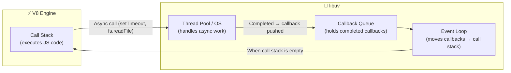
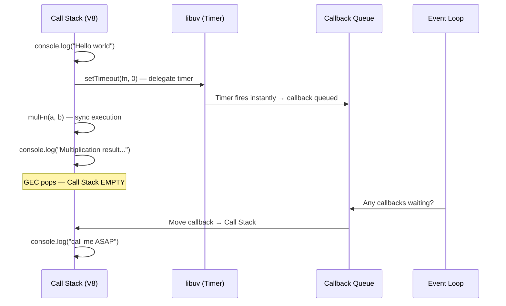

<div align="center">

|                                                       ← Previous                                                        | [📑 Table of Contents](../README.md#part-2) |                                                  Next →                                                  |
| :---------------------------------------------------------------------------------------------------------------------: | :-----------------------------------------: | :------------------------------------------------------------------------------------------------------: |
| [Chapter 6: libuv & async IO](../S1%2006%20-%20libuv%20%26%20async%20IO/Readme.md) |                                             | [Chapter 8: Deep dive into v8 JS Engine](../S1%2008%20-%20Deep%20dive%20into%20v8%20JS%20Engine/Readme.md) |

</div>

---

# Chapter 7 — sync, async, setTimeout Zero-Code &nbsp;

> **Season 1** | Part II — Node.js Architecture & Internals
> [🎬Link](https://namastedev.com/learn/namaste-node/sync-async-settimeoutzero-code)

---

### What is This Chapter About?

This chapter dives into the **execution mechanics** of synchronous and asynchronous code in Node.js — specifically how the **call stack**, **V8 engine**, **libuv**, and the **callback queue** work together. The star of this chapter is `setTimeout(fn, 0)` — which reveals that even a 0ms timer doesn’t execute immediately.

> 💡 Understanding this execution flow is one of the **most asked interview topics** in Node.js and JavaScript.

### How It Works

#### The Big Picture: Who Does What?

When Node.js executes your code, two systems work together:

| Component      | Handles                                                    | Execution Model        |
| -------------- | ---------------------------------------------------------- | ---------------------- |
| **V8 Engine**  | All JavaScript code — variables, functions, `console.log`  | Synchronous, single-threaded |
| **libuv**      | Async I/O — `setTimeout`, `fs.readFile`, `crypto.pbkdf2`, `https.get` | Asynchronous, event-driven |



**The Rule:** The event loop only moves callbacks from the queue to the call stack **when the call stack is empty** (all synchronous code has finished).

#### Synchronous Code — Call Stack in Action

V8 executes synchronous code using the **call stack** — a LIFO (Last In, First Out) data structure.

```javascript
console.log("Hello World");

var a = 1078698;
var b = 20986;

function mulFn(x, y) {
  const result = x * y;
  return result;
}

var c = mulFn(a, b);
console.log("Multiplication result is:", c);
```

**Step-by-step Call Stack Trace:**

```
Step 1: Program starts
  Call Stack: [GEC]                    ← Global Execution Context pushed
  Output: (nothing yet)

Step 2: console.log("Hello World")
  Call Stack: [GEC, console.log()]     ← console.log pushed
  Output: Hello World
  Call Stack: [GEC]                    ← console.log popped

Step 3: var a = 1078698, var b = 20986
  Call Stack: [GEC]                    ← Variables assigned in GEC
  (no function call, stays on same EC)

Step 4: mulFn(a, b) called
  Call Stack: [GEC, mulFn()]           ← mulFn EC pushed
  Inside mulFn: result = 1078698 * 20986 = 22637770428
  return result → c = 22637770428
  Call Stack: [GEC]                    ← mulFn EC popped

Step 5: console.log("Multiplication result is:", c)
  Call Stack: [GEC, console.log()]     ← console.log pushed
  Output: Multiplication result is: 22637770428
  Call Stack: [GEC]                    ← console.log popped

Step 6: Program ends
  Call Stack: []                       ← GEC popped, stack empty
```

**Output:**
```
Hello World
Multiplication result is: 22637770428
```

> 💡 Every line executes **sequentially**. The call stack never has more than **one function executing** at a time (single-threaded).

#### Asynchronous Code — V8 + libuv Working Together

When V8 encounters an async operation, it **delegates** the work to libuv and continues executing the next line. libuv notifies V8 via the callback queue when the work is done.

```javascript
const fs = require("fs");
const https = require("https");
const crypto = require("crypto");

console.log("Hello World");

// 1. Async file read — delegated to libuv's thread pool
fs.readFile("./file.txt", "utf-8", (err, data) => {
  console.log("File data is:", data);
});

// 2. Async HTTPS request — delegated to OS async primitives
https.get("https://dummyjson.com/products/1", (res) => {
  console.log("Fetched data successfully!");
});

// 3. Async timer — delegated to libuv's timer system
setTimeout(() => {
  console.log("setTimeout called after 5 sec");
}, 5000);

// 4. Async crypto — delegated to libuv's thread pool
crypto.pbkdf2("password", "salt", 5000, 50, "sha512", (err, key) => {
  console.log("Key is generated");
});

console.log("End of file");
```

**Execution Flow:**

```
Phase 1 — V8 executes all synchronous code:
─────────────────────────────────────────────
1. console.log("Hello World")                     → prints immediately
2. fs.readFile(...)                                → registers callback, delegates to libuv
3. https.get(...)                                  → registers callback, delegates to libuv
4. setTimeout(..., 5000)                           → registers callback, delegates to libuv
5. crypto.pbkdf2(...)                              → registers callback, delegates to libuv
6. console.log("End of file")                      → prints immediately

   Call stack is now EMPTY.

Phase 2 — libuv callbacks fire (order depends on completion time):
──────────────────────────────────────────────────────────────────
7. crypto.pbkdf2 callback     → "Key is generated"       (thread pool completes)
8. https.get callback          → "Fetched data successfully!" (network I/O completes)
9. fs.readFile callback        → "File data is: ..."      (file I/O completes)
10. setTimeout callback        → "setTimeout called after 5 sec" (5 seconds later)
```

**Output (approximate order):**
```
Hello World
End of file
Key is generated
Fetched data successfully!
File data is: (contents of file.txt)
setTimeout called after 5 sec
```

> ⚠️ The exact order of callbacks 7–9 depends on which operation completes first. `setTimeout` always fires last here because it has a 5-second delay. But **"Hello World"** and **"End of file"** always print first — because synchronous code runs before any callbacks.

#### `setTimeout(fn, 0)` — The Zero-Delay Trap

This is the most important concept in this chapter:

```javascript
console.log("Hello world");

var a = 1078698;
var b = 20986;

setTimeout(() => {
  console.log("call me ASAP");
}, 0);  // 0 milliseconds!

function mulFn(x, y) {
  const result = x * y;
  return result;
}

var c = mulFn(a, b);
console.log("Multiplication result is:", c);
```

**You might expect** `"call me ASAP"` to print immediately (it's 0ms!). But it **doesn't**:

**Output:**
```
Hello world
Multiplication result is: 22637770428
call me ASAP
```

**Why? Step-by-step with Call Stack + Callback Queue:**

```
Step 1: console.log("Hello world")
  Call Stack: [GEC, console.log()]
  Callback Queue: []
  Output: Hello world

Step 2: setTimeout(fn, 0)
  Call Stack: [GEC, setTimeout()]
  → setTimeout registers the callback with libuv (even with 0ms delay)
  → Callback goes to the Callback Queue (not the call stack!)
  Call Stack: [GEC]
  Callback Queue: [fn: "call me ASAP"]

Step 3: mulFn(a, b) called
  Call Stack: [GEC, mulFn()]
  → result = 1078698 * 20986
  Call Stack: [GEC]

Step 4: console.log("Multiplication result is:", c)
  Call Stack: [GEC, console.log()]
  Output: Multiplication result is: 22637770428
  Call Stack: [GEC]

Step 5: Program ends, GEC popped
  Call Stack: []          ← NOW the call stack is empty!
  Callback Queue: [fn: "call me ASAP"]

Step 6: Event Loop checks — "Call stack empty? Yes. Callback waiting? Yes."
  → Moves callback from queue to call stack
  Call Stack: [fn]
  Output: call me ASAP
  Call Stack: []
```



> 💡 **`setTimeout(fn, 0)` does NOT mean "execute immediately."** It means "execute as soon as the call stack is empty and the event loop reaches the timer phase." All synchronous code **always** runs first.

#### `readFileSync` vs `readFile` — The Common Mistake

##### ❌ Wrong: Passing a callback to `readFileSync`

```javascript
// ❌ INCORRECT — readFileSync does NOT accept callbacks
fs.readFileSync("./file.txt", "utf-8", (err, data) => {
  console.log("File data:", data);
});
// The callback is silently ignored! Nothing prints.
// The file IS read, but the return value isn't captured.
```

##### ✅ Correct: Synchronous file read

```javascript
// ✅ CORRECT — capture the return value
try {
  const data = fs.readFileSync("./file.txt", "utf-8");
  console.log("File data:", data);
} catch (err) {
  console.error("Error:", err.message);
}
// Blocks the call stack until file is fully read
```

##### ✅ Correct: Asynchronous file read

```javascript
// ✅ CORRECT — use callback with async readFile
fs.readFile("./file.txt", "utf-8", (err, data) => {
  if (err) {
    console.error("Error:", err.message);
    return;
  }
  console.log("File data:", data);
});
// Does NOT block — delegates to libuv, callback fires when done
```

| Method            | Blocking? | Returns Data?  | Uses Callback? | Error Handling              |
| ----------------- | --------- | -------------- | -------------- | --------------------------- |
| `readFileSync()`  | ✅ Yes     | ✅ Return value | ❌ No           | `try/catch`                 |
| `readFile()`      | ❌ No      | ❌ Via callback  | ✅ Yes          | `(err, data)` callback arg  |

#### Execution Order Prediction — Interview Pattern

**Predict the output:**

```javascript
console.log("Start");

setTimeout(() => console.log("Timer 1"), 0);

Promise.resolve().then(() => console.log("Promise 1"));

setTimeout(() => console.log("Timer 2"), 0);

Promise.resolve().then(() => console.log("Promise 2"));

console.log("End");
```

<details>
<summary><strong>Click to see the answer</strong></summary>

```
Start
End
Promise 1
Promise 2
Timer 1
Timer 2
```

**Why this order?**
1. `"Start"` and `"End"` — synchronous, run first
2. `"Promise 1"` and `"Promise 2"` — **microtask queue** (higher priority than callback queue)
3. `"Timer 1"` and `"Timer 2"` — **callback queue** (timer phase of event loop)

> 💡 **Microtasks** (Promises, `process.nextTick`) always run before **macrotasks** (setTimeout, setInterval, I/O callbacks). This is covered in depth in Chapter 9.

</details>

**One more — predict the output:**

```javascript
console.log("1");

setTimeout(() => console.log("2"), 1000);
setTimeout(() => console.log("3"), 0);

fs.readFile("./file.txt", "utf-8", () => console.log("4"));

console.log("5");
```

<details>
<summary><strong>Click to see the answer</strong></summary>

```
1
5
3
4     (depends on file read speed — could swap with 3)
2
```

**Why?**
1. `"1"` and `"5"` — synchronous, run first
2. `"3"` — `setTimeout(0)` fires after call stack clears
3. `"4"` — `fs.readFile` completes (usually fast for small files)
4. `"2"` — `setTimeout(1000)` fires after 1 second

</details>

### Code Example

#### Complete Demo: Sync + Async + setTimeout(0)

```javascript
const fs = require("fs");
const crypto = require("crypto");

console.log(">>> START");

// Sync: blocks the call stack
const data = fs.readFileSync("./file.txt", "utf-8");
console.log("Sync file read done");

// Async: setTimeout(0) — goes to callback queue
setTimeout(() => {
  console.log("setTimeout(0) fired");
}, 0);

// Async: crypto — goes to libuv thread pool
crypto.pbkdf2("password", "salt", 5000, 50, "sha512", (err, key) => {
  console.log("Crypto key generated");
});

// Async: file read — goes to libuv thread pool
fs.readFile("./file.txt", "utf-8", (err, data) => {
  console.log("Async file read done");
});

// Sync: runs immediately
console.log(">>> END");
```

**Output:**
```
>>> START
Sync file read done
>>> END
setTimeout(0) fired
Crypto key generated
Async file read done
```

**Analysis:**

| Line | Type | When It Runs |
|------|------|-------------|
| `">>> START"` | Sync | Immediately |
| `"Sync file read done"` | Sync (blocking) | Immediately (blocks until file is read) |
| `">>> END"` | Sync | Immediately |
| `"setTimeout(0) fired"` | Async (timer) | After call stack clears |
| `"Crypto key generated"` | Async (thread pool) | When crypto completes |
| `"Async file read done"` | Async (thread pool) | When file read completes |

### Common Mistakes

| Mistake                                                          | Why It's Wrong                                                                                                                              |
| ---------------------------------------------------------------- | ------------------------------------------------------------------------------------------------------------------------------------------- |
| "`setTimeout(fn, 0)` runs the callback immediately"             | ❌ The callback goes to the **callback queue** and only runs when the call stack is empty — after all synchronous code finishes              |
| "Passing a callback to `readFileSync`"                           | ❌ `readFileSync` is synchronous and **ignores callbacks**. It returns data directly. Use `readFile` for callback-based async reads           |
| "Async callbacks run in the order they were registered"          | ❌ Callbacks run in the order their **operations complete** — not the order they were registered. Network may finish before disk, or vice versa |
| "The call stack can hold async callbacks while sync code runs"   | ❌ Callbacks wait in the **callback queue** until the call stack is **completely empty**. The event loop enforces this                        |
| "`setTimeout(fn, 5000)` guarantees exactly 5 seconds"            | ❌ It guarantees **at least** 5 seconds. If the call stack is busy, the callback waits longer (this is the "trust issue" with `setTimeout`)  |
| "V8 handles `setTimeout` and `fs.readFile`"                      | ❌ V8 only executes JavaScript. Timers, I/O, and async ops are handled by **libuv**. V8 just runs the callbacks when they reach the call stack |

<div style="font-size: 22px; color: red">
<details>
  <summary><strong>Interview Questions (Click to View)</strong></summary>
  <div style="font-size: 0.9rem; color: black; background:#fff; border:2px solid red; border-radius: 10px;">

- **Q: What happens when you call `setTimeout(fn, 0)` in Node.js?**
  - A: The callback `fn` is **not** executed immediately. `setTimeout` delegates the timer to libuv, which places the callback in the **callback queue** after 0ms. However, the callback only runs when the **call stack is empty** — meaning all synchronous code must finish first. So `setTimeout(fn, 0)` effectively means "run this as soon as possible after the current synchronous code completes."

- **Q: What is the call stack and how does it work?**
  - A: The call stack is a LIFO (Last In, First Out) data structure that tracks function execution. When a function is called, an Execution Context is pushed onto the stack. When it returns, it's popped off. V8 always executes the topmost item. JavaScript is single-threaded — only one function runs at a time.

- **Q: What is the difference between `fs.readFileSync` and `fs.readFile`?**
  - A: `readFileSync` is **synchronous** — it blocks the call stack until the file is fully read and returns the data directly. `readFile` is **asynchronous** — it delegates the read to libuv's thread pool and invokes a callback when done, without blocking the call stack. Never pass a callback to `readFileSync` — it will be silently ignored.

- **Q: What is the role of V8 vs libuv in Node.js?**
  - A: **V8** executes all JavaScript code synchronously on a single thread (the call stack). **libuv** handles all asynchronous operations — timers, file I/O, network I/O, crypto — using its event loop, thread pool, and OS async primitives. When an async operation completes, libuv pushes the callback to the callback queue, and the event loop moves it to the call stack when it's empty.

- **Q: Why does synchronous code always run before async callbacks?**
  - A: Because the event loop only checks the callback queue when the **call stack is empty**. As long as there's synchronous code on the call stack, no callbacks are processed. This is why `setTimeout(fn, 0)` still runs after all sync code — the event loop waits for the stack to clear.

- **Q: Does `setTimeout(fn, 5000)` guarantee the callback runs in exactly 5 seconds?**
  - A: No. It guarantees **at least** 5 seconds. If the call stack is busy (e.g., a long-running synchronous operation), the callback waits in the queue until the stack clears — which could be longer than 5 seconds. This is often called the "trust issue" with `setTimeout`.

- **Q: In what order do async callbacks execute?**
  - A: Callbacks execute in the order their **operations complete**, not the order they were registered. A fast network call may complete before a slow file read, even if the file read was started first. The event loop processes them as they arrive in the callback queue.

- **Q: What is the callback queue?**
  - A: The callback queue (also called the task queue or macrotask queue) holds callbacks from completed async operations — timers (`setTimeout`, `setInterval`), I/O operations (`fs.readFile`, `https.get`), etc. The event loop dequeues one callback at a time and pushes it to the call stack when the stack is empty.

- **Q: What is the difference between microtasks and macrotasks?**
  - A: **Microtasks** (Promises, `process.nextTick`) have higher priority — they run **between** each macrotask and always before the next macrotask. **Macrotasks** (`setTimeout`, `setInterval`, I/O callbacks) run one per event loop tick. This is why `Promise.resolve().then(fn)` fires before `setTimeout(fn, 0)`.

- **Q: What happens if you run blocking code inside an async callback?**
  - A: It blocks the call stack just like any synchronous code. Since Node.js is single-threaded, no other callbacks can execute while the call stack is occupied. This is why you should **never** do CPU-heavy synchronous work inside callbacks — it blocks the entire event loop.

    </div>
  </details>
  </div>

### Key Takeaways

- **V8** executes JavaScript synchronously on the call stack; **libuv** handles all async operations
- Synchronous code **always** runs before any async callbacks — the event loop waits for the call stack to clear
- **`setTimeout(fn, 0)` does NOT mean "run immediately"** — it means "run after all sync code finishes and the event loop reaches the timer phase"
- The **callback queue** holds completed async callbacks; the **event loop** moves them to the call stack only when it's empty
- `readFileSync` returns data directly (blocking); `readFile` uses a callback (non-blocking) — **never** pass a callback to `readFileSync`
- Async callbacks execute in the order their **operations complete**, not registration order
- **Microtasks** (Promises, `process.nextTick`) always run before **macrotasks** (`setTimeout`, I/O callbacks)
- `setTimeout` guarantees **at least** N milliseconds, not exactly N — the call stack might delay it
- Understanding this execution model is **essential for Node.js interviews** — practice predicting output order

---

<div align="center">

|                                                       ← Previous                                                        | [📑 Table of Contents](../README.md#part-2) |                                                  Next →                                                  |
| :---------------------------------------------------------------------------------------------------------------------: | :-----------------------------------------: | :------------------------------------------------------------------------------------------------------: |
| [Chapter 6: libuv & async IO](../S1%2006%20-%20libuv%20%26%20async%20IO/Readme.md) |                                             | [Chapter 8: Deep dive into v8 JS Engine](../S1%2008%20-%20Deep%20dive%20into%20v8%20JS%20Engine/Readme.md) |

</div>
