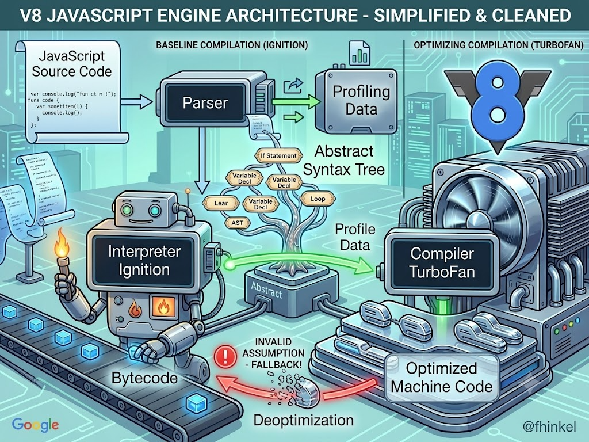
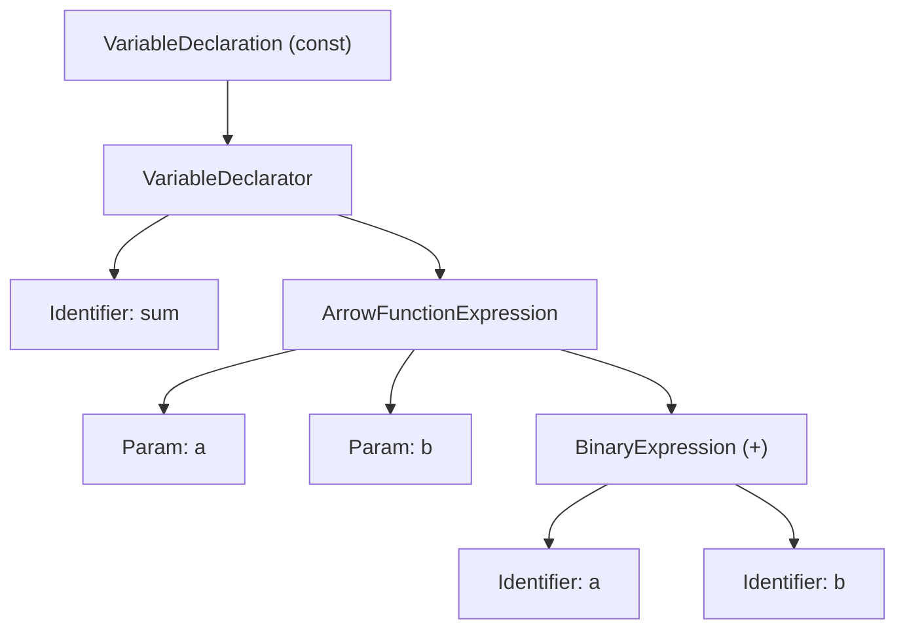
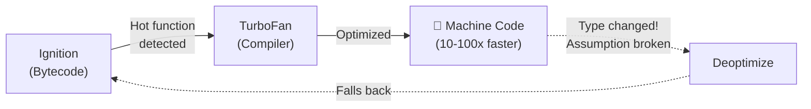
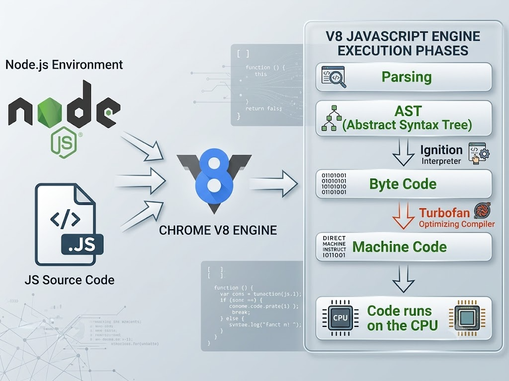
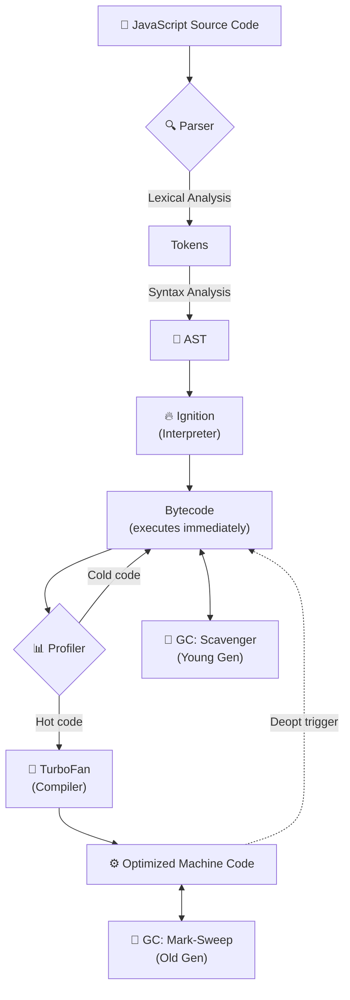

<div align="center">

|                                                       ← Previous                                                       | [📑 Table of Contents](../README.md#part-2) |                                          Next →                                          |
| :--------------------------------------------------------------------------------------------------------------------: | :-----------------------------------------: | :--------------------------------------------------------------------------------------: |
| [Chapter 7: sync, async, setTimeout Zero-Code](../S1%2007%20-%20sync%2C%20async%2C%20setTimeout%20Zero-Code/Readme.md) |                                             | [Chapter 9: libuv and event loop](../S1%2009%20-%20libuv%20and%20event%20loop/Readme.md) |

</div>

---

# Chapter 8 — Deep Dive into V8 JS Engine &nbsp;

> **Season 1** | Part II — Node.js Architecture & Internals
> [🎬Link](https://namastedev.com/learn/namaste-node/deep-dive-into-v8-js-engine)

---

### What is This Chapter About?

This chapter takes you **inside the V8 engine** — the heart of both Chrome and Node.js. You’ll learn how JavaScript goes from text to machine code, how V8 optimizes hot paths, and how it manages memory through garbage collection.

> 💡 V8 is what makes JavaScript **competitive with C++ and Go** for server-side performance.

### How It Works

#### V8 Architecture — The Big Picture



V8 is an open-source JavaScript engine written in **C++**, created by Google.

| Fact            | Detail                                   |
| --------------- | ---------------------------------------- |
| **Language**    | C++                                      |
| **Created by**  | Google (Lars Bak, 2008)                  |
| **Used in**     | Chrome, Node.js, Deno, Electron          |
| **Compilation** | JIT (Just-In-Time) — compiles at runtime |
| **Repo**        | `deps/v8/` inside Node.js source         |

```
V8 Engine Architecture:
┌──────────────────────────────────────────────────────────┐
│              📄 JavaScript Source Code                   │
└────────────────────────────┴─────────────────────────────┘
                             │
                             ▼
┌──────────────────────────────────────────────────────────┐
│  🔍 Parser (Lexical + Syntax Analysis)                   │
│  Tokens → AST (Abstract Syntax Tree)                     │
└────────────────────────────┴─────────────────────────────┘
                             │
                             ▼
┌──────────────────────────────────────────────────────────┐
│  🔥 Ignition (Interpreter)                               │
│  AST → Bytecode — fast startup, collects profiling data  │
└──────────────┴─────────────────────────────┬─────────────┘
               │                              │
          Cold code                     Hot code detected
          (stays bytecode)              (frequently executed)
                                               │
                                               ▼
                              ┌─────────────────────────────┐
                              │  🚀 TurboFan (Compiler)    │
                              │  Bytecode → Machine Code    │
                              └──────────────┬──────────────┘
                                             │
                                             ▼
                              ┌─────────────────────────────┐
                              │  ⚙️ Machine Code            │
                              │  (CPU executes directly)    │
                              └─────────────────────────────┘

  🧹 Garbage Collector runs throughout (Scavenger + Mark-Sweep-Compact)
```

---

### Phase 1: Parsing

> V8 parses JavaScript in two stages:

**Lexical Analysis** — breaks code into tokens (keywords, identifiers, operators, literals).

**Syntax Analysis** — arranges tokens into an **AST (Abstract Syntax Tree)**:

```javascript
const sum = (a, b) => a + b;
```



> 💡 Explore ASTs at [astexplorer.net](https://astexplorer.net/)

**Lazy vs Eager Parsing:**

| Strategy  | When Used                            | Why                                 |
| --------- | ------------------------------------ | ----------------------------------- |
| **Eager** | Top-level code, immediately invoked  | About to execute — needs full parse |
| **Lazy**  | Function declarations not yet called | Saves time — parse only when needed |

---

### Phase 2: Ignition (Interpreter)

> _The AST is passed to **Ignition**, V8’s interpreter. Ignition converts the AST into **bytecode** — a compact, intermediate representation that’s faster to execute than raw AST walking._

| Aspect           | Detail                                            |
| ---------------- | ------------------------------------------------- |
| **Input**        | AST from the parser                               |
| **Output**       | Bytecode (register-based, compact)                |
| **Speed**        | Starts executing quickly (no compilation delay)   |
| **Optimization** | None — runs code as-is, collecting profiling data |
| **Key Benefit**  | Fast startup (no compilation delay)               |

```javascript
// Source code:
function add(a, b) {
  return a + b;
}
```

```
// Bytecode produced by Ignition (simplified):
LdaNamedProperty a0, [0]    // Load parameter 'a'
Add a1                       // Add parameter 'b'
Return                       // Return result
```

💡 Ignition is critical for **startup performance**. Instead of waiting for full compilation, V8 starts running bytecode immediately. The key insight: **"fast startup is more important than peak performance for most code."**

---

### Phase 3: Profiling (Hotspot Detection)

> _As Ignition runs bytecode, it **profiles** the code — tracking call frequency and type information. Functions called many times are marked as **"hot"** and sent to TurboFan._

| What the Profiler Tracks | Why It Matters                                                                         |
| ------------------------ | -------------------------------------------------------------------------------------- |
| **Call frequency**       | Functions called many times are candidates for optimization                            |
| **Type information**     | If `add(a, b)` always receives numbers, TurboFan can optimize for numbers specifically |
| **Branch patterns**      | Which `if/else` branches are taken most often                                          |

```javascript
// This function is called 10,000 times with numbers
function add(a, b) {
  return a + b;
}

for (let i = 0; i < 10000; i++) {
  add(i, i + 1); // V8 profiles: "add() is HOT, always receives numbers"
}
```

💡 After enough calls, V8 marks `add()` as **"hot"** and sends it to TurboFan for optimization.

---

### Phase 4: TurboFan (Optimizing Compiler)

> _Takes hot bytecode and compiles it into **optimized machine code** using profiling data._



**Optimization Example:**

```javascript
// V8 sees add() is always called with numbers
function add(a, b) {
  return a + b;
}

// TurboFan generates optimized machine code:
// - Skip type checks (assumes a, b are always numbers)
// - Use CPU integer addition instruction directly
// - Inline the function at call sites

// ✅ 10,000 calls with numbers → optimized
for (let i = 0; i < 10000; i++) {
  add(i, i + 1);
}

// ❌ Then suddenly:
add("hello", "world"); // String! TurboFan's assumption BREAKS
// → DEOPTIMIZATION: falls back to Ignition bytecode
```

💡 **Deoptimization** happens when TurboFan’s assumptions break (e.g., a function optimized for numbers suddenly receives a string). The optimized code is thrown away and V8 falls back to Ignition bytecode.

---

#### JIT Compilation (Why Not AOT?)

V8 uses **JIT (Just-In-Time)** — compiles at runtime, not before execution.

| Strategy | When Compiled              | Pros                                | Cons                    |
| -------- | -------------------------- | ----------------------------------- | ----------------------- |
| **AOT**  | Before execution (C++, Go) | Fast execution                      | No runtime optimization |
| **JIT**  | During execution (V8, JVM) | Fast startup + runtime optimization | Memory overhead         |

> 💡 **Why JIT wins for JS:** JavaScript is dynamically typed — `a + b` could be numbers or strings. JIT observes actual runtime types and optimizes specifically for them.

---

#### Hidden Classes & Inline Caching

**Hidden Classes (Shapes)** — V8 assigns internal "maps" to objects with the same property structure for fast access:

```javascript
// ✅ Same shape → shared hidden class → fast
const user1 = { name: "Harshit", age: 25 };
const user2 = { name: "Akshay", age: 30 };

// ❌ Different order → different hidden class → slower
const user3 = { age: 28, name: "Priya" };
```

**Inline Caching (IC)** — caches property lookup results for repeated access:

| IC State        | Shapes Seen | Speed      |
| --------------- | ----------- | ---------- |
| **Monomorphic** | 1 shape     | 🚀 Fastest |
| **Polymorphic** | 2–4 shapes  | ⚡ Fast    |
| **Megamorphic** | 5+ shapes   | 🐌 Slow    |

---

### Phase 5: Garbage Collection

> _V8 uses **generational GC** — most objects die young, so it optimizes for that._



```
V8 Heap Memory:
┌──────────────────────────────────────────────────────────┐
│  Young Generation (~1-8 MB)    │  Old Generation (~100s MB)    │
│  Short-lived objects            │  Long-lived objects            │
│  GC: Scavenger (fast, ~1-5ms)  │  GC: Mark-Sweep-Compact       │
│  Semi-space copying            │  (slower, ~10-50ms)            │
└──────────────────────────────────────────────────────────┘
  Objects surviving 2+ GC cycles are PROMOTED: Young → Old
```

| GC Type                | Target    | Speed       | Algorithm                             |
| ---------------------- | --------- | ----------- | ------------------------------------- |
| **Scavenger**          | Young Gen | 🚀 ~1-5ms   | Semi-space copying                    |
| **Mark-Sweep-Compact** | Old Gen   | 🐌 ~10-50ms | Mark reachable → Sweep dead → Compact |

| Memory Area          | What’s Stored                            |
| -------------------- | ---------------------------------------- |
| **Stack**            | Primitives, function call frames         |
| **Heap — New Space** | Newly created objects                    |
| **Heap — Old Space** | Objects that survived multiple GC cycles |
| **Code Space**       | Compiled machine code from TurboFan      |

---

### Phase-6: Optimization Killers — Patterns to Avoid

| Anti-Pattern              | Why It Kills Optimization                | Fix                               |
| ------------------------- | ---------------------------------------- | --------------------------------- |
| **Changing object shape** | Creates new hidden classes               | Initialize all properties upfront |
| **`delete` operator**     | Destroys hidden class                    | Set to `undefined` instead        |
| **`eval()`**              | V8 can’t analyze code inside             | Never use in production           |
| **`arguments` leaks**     | Prevents function optimization           | Use rest params (`...args`)       |
| **Type changes**          | Triggers deoptimization                  | Keep types consistent             |
| **Polymorphic functions** | Different object shapes → megamorphic IC | Keep arguments consistent         |

<details style="font-size: 22px;  color: chocolate">
<summary><strong>🔄 The Complete V8 Pipeline — Summary Flow (Click to View)</strong></summary>



</details>

---

### Common Mistakes

| Mistake                                 | Why It’s Wrong                                                                         |
| --------------------------------------- | -------------------------------------------------------------------------------------- |
| "V8 interprets JavaScript line by line" | ❌ V8 uses a **two-tier JIT**: Ignition (bytecode) + TurboFan (machine code)           |
| "JavaScript is always slow"             | ❌ TurboFan compiles hot paths to **optimized machine code** rivaling C++              |
| "GC stops the entire program"           | ❌ V8 uses **incremental and concurrent GC** — most work happens in background         |
| "All objects are stored the same way"   | ❌ V8 uses **hidden classes** for fast struct-like access on same-shaped objects       |
| "`delete obj.prop` is harmless"         | ❌ `delete` **destroys hidden classes**. Use `obj.prop = undefined` instead            |
| "JIT and AOT are the same"              | ❌ **AOT** compiles before execution. **JIT** compiles during, using runtime profiling |
| "V8 parses the entire file upfront"     | ❌ V8 uses **lazy parsing** — defers functions until they’re actually called           |

<div style="font-size: 22px; color: red">
<details>
  <summary><strong>Interview Questions (Click to View)</strong></summary>
  <div style="font-size: 0.9rem; color: black; background:#fff; border:2px solid red; border-radius: 10px;">

- **Q: What is V8 and what role does it play in Node.js?**
  - A: V8 is a **C++ JavaScript engine** by Google. It compiles JS to machine code using JIT. In Node.js, V8 handles all JS execution; Node.js adds libuv on top for async I/O.

- **Q: What is the difference between Ignition and TurboFan?**
  - A: **Ignition** is V8’s interpreter — converts AST to bytecode for fast startup. **TurboFan** is the optimizing compiler — compiles hot bytecode to machine code for peak performance.

- **Q: What is deoptimization?**
  - A: When TurboFan’s type assumptions break (e.g., function optimized for numbers receives a string), V8 throws away optimized code and falls back to Ignition bytecode. This is expensive.

- **Q: What are Hidden Classes in V8?**
  - A: Internal data structures V8 assigns to objects with the same property layout. Same properties in same order = shared hidden class = fast access. Different order or `delete` = new hidden class = slow.

- **Q: How does V8’s garbage collection work?**
  - A: **Generational GC**: Scavenger handles Young Gen (short-lived, fast ~1-5ms). Mark-Sweep-Compact handles Old Gen (long-lived, slower). Objects promoted Young → Old after surviving multiple cycles.

- **Q: Why does V8 use JIT instead of AOT?**
  - A: JavaScript is dynamically typed — `a + b` could be numbers or strings. AOT can’t know types before runtime. JIT observes actual runtime types and optimizes specifically for them.

    </div>
  </details>
  </div>

### Key Takeaways

- V8 is a **C++ JS engine** using a two-tier **JIT** system (Ignition + TurboFan)
- **Parsing**: source → tokens → AST. Uses **lazy parsing** for uncalled functions
- **Ignition** generates bytecode (fast startup); **TurboFan** optimizes hot code to machine code
- **Deoptimization** happens when type assumptions break — keep types consistent!
- **Hidden Classes** + **Inline Caching** = fast property access for same-shaped objects
- **GC** is generational: Scavenger (young, fast) + Mark-Sweep-Compact (old, thorough)
- **Avoid**: `eval()`, `delete`, type changes, polymorphic functions, `arguments` leaks

---

<div align="center">

|                                                       ← Previous                                                       | [📑 Table of Contents](../README.md#part-2) |                                          Next →                                          |
| :--------------------------------------------------------------------------------------------------------------------: | :-----------------------------------------: | :--------------------------------------------------------------------------------------: |
| [Chapter 7: sync, async, setTimeout Zero-Code](../S1%2007%20-%20sync%2C%20async%2C%20setTimeout%20Zero-Code/Readme.md) |                                             | [Chapter 9: libuv and event loop](../S1%2009%20-%20libuv%20and%20event%20loop/Readme.md) |

</div>
