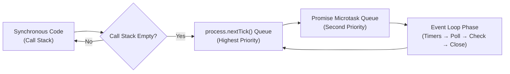

<div align="center">

|                                                 ← Previous                                                 | [📑 Table of Contents](../README.md#part-2) |                                          Next →                                           |
| :--------------------------------------------------------------------------------------------------------: | :-----------------------------------------: | :---------------------------------------------------------------------------------------: |
| [Chapter 8: Deep dive into v8 JS Engine](../S1%2008%20-%20Deep%20dive%20into%20v8%20JS%20Engine/Readme.md) |                                             | [Chapter 10: Thread pool in libuv](../S1%2010%20-%20Thread%20pool%20in%20libuv/Readme.md) |

</div>

---

# Chapter 9 — libuv & Event Loop &nbsp;

> **Season 1** | Part II — Node.js Architecture & Internals
> [🎬Link](https://namastedev.com/learn/namaste-node/libuv-event-loop)

---

<a id="key-topics"></a>

### Topics Covering

> 1. [The Event Loop — 6 Phases Overview](#topic-1)
> 2. [Inner Event Loop Flow (Call Stack, Phases & Microtasks)](#topic-2)
> 3. [Microtask Queues — The Priority Lane (`nextTick` vs `Promise`)](#topic-3)
> 4. [Practice Code Files & Step-by-Step Execution Examples](#topic-4)

---

### What is This Chapter About?

This chapter explains the **event loop** — the core mechanism that makes Node.js non-blocking. You’ll learn its 6 phases, where each type of callback runs, and how `process.nextTick()` and Promises (microtasks) jump the queue ahead of everything else.

> 💡 The event loop is the **#1 most asked Node.js interview topic**. Master the phase order and you’ll nail any "predict the output" question.

<a id="topic-1"></a>

## 1. [The Event Loop — 6 Phases Overview](#key-topics)


- The event loop in libuv operates in a **continuous cycle** through 6 phases. Each phase has a queue of callbacks to execute:
- ⚠️ Between EVERY phase: process.nextTick() + Promise microtasks run
- 💡 When the event loop is empty and there are no more tasks, it enters the **Poll phase** and waits for incoming I/O events.

| #   | Phase                 | What Runs Here                                   | Key API                         |
| --- | --------------------- | ------------------------------------------------ | ------------------------------- |
| 1   | **Timers**            | Expired `setTimeout` / `setInterval` callbacks   | `setTimeout()`, `setInterval()` |
| 2   | **Pending Callbacks** | Deferred I/O callbacks (e.g., TCP errors)        | Internal to libuv               |
| 3   | **Idle / Prepare**    | Internal housekeeping by libuv                   | Not user-facing                 |
| 4   | **Poll**              | I/O callbacks (`fs.readFile`, `https.get`, etc.) | `fs.readFile()`, network I/O    |
| 5   | **Check**             | `setImmediate()` callbacks                       | `setImmediate()`                |
| 6   | **Close Callbacks**   | Cleanup callbacks (`socket.on('close')`)         | `.on('close')`                  |

<a id="topic-2"></a>

## 2. [Inner Event Loop Flow (Call Stack, Phases & Microtasks)](#key-topics)

```
        ┌──────────────────────────────────────────────────────────┐
        │                   CALL STACK (V8)                        │
        │  Executes all synchronous code first, then empties out   │
        └───────────────────────────┬──────────────────────────────┘
                                    │
                           Call Stack Empty? --> No --> Keep executing sync code
                                    │
                                   Yes
                                    │
                                    ▼
          ┌─────────────── EVENT LOOP BEGINS ───────────────────┐
          │                       ↻ ↻                          │
          │                    ___________________________      │
          │                   |                           |     │
          │                   ▼                           |     │
          │   process.nextTick() ──► Promise callbacks    |     │
          │                   |                           |     │
          │                   ▼                           ▲     │
          │                 Timer                         |     │
          │        [setTimeout/setInterval]               |     │
          │                   |                           |     │
          │                   ▼                           |     │
          │   process.nextTick() ──► Promise callbacks    |     │
          │                   |                           |     │
          │                   ▼                           ▲     │
          │                  Poll                         |     │
          │   [I/O Callbacks, fs, crypto, http, data]     |     │
          │                   |                           |     │
          │                   ▼                           |     │
          │   process.nextTick() ──► Promise callbacks    |     │
          │                   |                           |     │
          │                   ▼                           ▲     │
          │                 Check                         |     │
          │             [setImmediate]                    |     │
          │                   |                           |     │
          │                   ▼                           |     │
          │   process.nextTick() ──► Promise callbacks    |     │
          │                   |                           |     │
          │                   ▼                           ▲     │
          │                Close                          |     │
          │          [socket.on("close")]                 |     │
          │                   |                           |     │
          │                   ▼___________________________|     │
          │                                                     │
          └─────────────────────────────────────────────────────┘

  Flow: Call Stack (sync) → nextTick → Promises → Timer → nextTick → Promises
        → Poll → nextTick → Promises → Check → nextTick → Promises → Close → ↻
```

---

<a id="topic-3"></a>

## 3. [Microtask Queues — The Priority Lane (`nextTick` vs `Promise`)](#key-topics)

Microtasks run **between every phase** of the event loop, not inside any specific phase. They have **higher priority** than all 6 phases:



| Priority   | Queue            | API                                  | When It Runs                              |
| ---------- | ---------------- | ------------------------------------ | ----------------------------------------- |
| 🥇 **1st** | nextTick queue   | `process.nextTick()`                 | Before anything else, between every phase |
| 🥈 **2nd** | Microtask queue  | `Promise.then()`, `queueMicrotask()` | After nextTick queue, between every phase |
| 🥉 **3rd** | Macrotask queues | `setTimeout`, `setImmediate`, I/O    | During their respective event loop phases |

> ⚠️ **Critical Rule:** `process.nextTick()` and Promises are **NOT** part of the event loop phases. They run in between — after the current operation completes but before the event loop continues to the next phase.

---

---

<a id="topic-4"></a>

## 4. [Practice Code Files & Step-by-Step Execution Examples](#key-topics)

| File                                    | What It Demonstrates                               |
| --------------------------------------- | -------------------------------------------------- |
| [`Eventloop1.js`](./Code/Eventloop1.js) | Basic: setImmediate + readFile + setTimeout + sync |
| [`Eventloop2.js`](./Code/Eventloop2.js) | Adds: Promise + process.nextTick priority          |
| [`Eventloop3.js`](./Code/Eventloop3.js) | Nested: callbacks registered inside readFile       |
| [`Eventloop4.js`](./Code/Eventloop4.js) | Nested: process.nextTick inside process.nextTick   |
| [`file.txt`](./Code/file.txt)           | "Hi this is demonstration of the event loop"       |

---

### Example 1: Basic Event Loop

> 📁 [`Eventloop1.js`](./Code/Eventloop1.js)

```javascript
const fs = require("fs");
const a = 999;

setImmediate(() => console.log("setImmediate"));

fs.readFile("./file.txt", "utf-8", (err, data) => {
  console.log(data);
});

setTimeout(() => console.log("set timeout"), 0);

function printA() {
  console.log("a=" + a);
}
printA();

console.log("Last line of program");
```

<details>
<summary><strong>🔍 Output (Click to View Answer)</strong></summary>

```
a=999
Last line of program
set timeout
setImmediate
Hi this is demonstration of the event loop
```

</details>

</br>

**Why this order?**

1. **`a=999`** and **`Last line of program`** — synchronous, run first
2. **`set timeout`** — Timers phase (setTimeout with 0ms)
3. **`setImmediate`** — Check phase (after timers)
4. **`file data`** — Poll phase (I/O completes last, depends on file read speed)

> 💡 `setTimeout(0)` vs `setImmediate` order is **non-deterministic** at the top level. Inside an I/O callback, `setImmediate` always runs first.

---

### Example 2: Adding nextTick & Promise

> 📁 [`Eventloop2.js`](./Code/Eventloop2.js)

```javascript
const fs = require("fs");
const a = 999;

setImmediate(() => console.log("setImmediate"));

Promise.resolve("promise").then(console.log);

fs.readFile("./file.txt", "utf-8", (err, data) => {
  console.log(data);
});

setTimeout(() => console.log("setimeout"), 0);

process.nextTick(() => console.log("Process.nexttick"));

function printA() {
  console.log("a:" + a);
}
printA();
console.log("last line of program");
```

<details>
<summary><strong>🔍 Output (Click to View Answer)</strong></summary>

```
a:999
last line of program
Process.nexttick
promise
setimeout
setImmediate
Hi this is demonstration of the event loop
```

</details>

</br>

**Why this order?**

1. **`a:999`** and **`last line of program`** — synchronous, run first
2. **`Process.nexttick`** — nextTick queue (highest priority microtask)
3. **`promise`** — Promise microtask queue (runs after nextTick)
4. **`setimeout`** — Timers phase
5. **`setImmediate`** — Check phase
6. **`file data`** — Poll phase (I/O completes last)

> 💡 `process.nextTick()` **always** runs before Promises, which **always** run before any event loop phase.

---

## Example 3: Nested Callbacks Inside I/O

> 📁 [`Eventloop3.js`](./Code/Eventloop3.js)

```javascript
const fs = require("fs");

setImmediate(() => console.log("1st setImmediate"));

setTimeout(() => console.log("1st timer"), 0);

Promise.resolve("promise").then(console.log);

fs.readFile("./file.txt", "utf-8", (err, data) => {
  setTimeout(() => console.log("2nd timer"), 0);

  process.nextTick(() => console.log("2nd Process.nexttick"));

  setImmediate(() => console.log("2nd setImmediate"));

  console.log(data);
});

process.nextTick(() => console.log("1st Process.nexttick"));

console.log("last line of program");
```

<details>
<summary><strong>🔍 Output (Click to View Answer)</strong></summary>

```
last line of program
1st Process.nexttick
promise
1st timer
1st setImmediate
Hi this is demonstration of the event loop
2nd Process.nexttick
2nd setImmediate
2nd timer
```

</details>

</br>

**Why this order?**

**Phase 1 — Synchronous:**

1. `"last line of program"` — sync code runs first

**Phase 2 — Microtasks (before event loop starts):** 2. `"1st Process.nexttick"` — nextTick queue 3. `"promise"` — Promise microtask queue

**Phase 3 — Event loop begins:** 4. `"1st timer"` — Timers phase 5. `"1st setImmediate"` — Check phase 6. `"Hi this is..."` — Poll phase (readFile callback fires)

**Phase 4 — Inside the readFile callback, new tasks are registered:** 7. `"2nd Process.nexttick"` — nextTick runs immediately after the callback 8. `"2nd setImmediate"` — Check phase (inside I/O, setImmediate runs before setTimeout) 9. `"2nd timer"` — Timers phase (next loop iteration)

> 💡 **Key insight:** Inside an I/O callback (Poll phase), `setImmediate` always runs **before** `setTimeout` — because the Check phase comes right after Poll.

---

## Example 4: Nested nextTick

> 📁 [`Eventloop4.js`](./Code/Eventloop4.js)

```javascript
const fs = require("fs");

setImmediate(() => console.log("setimmediate"));
setTimeout(() => console.log("settimeout"));
Promise.resolve("Promise").then(console.log);

fs.readFile("./file.txt", "utf-8", (err, data) => {
  console.log(data);
});

process.nextTick(() => {
  process.nextTick(() => console.log("inner nexttick"));
  console.log("process.nexttick");
});

console.log("last line of program");
```

<details>
<summary><strong>🔍 Output (Click to View Answer)</strong></summary>

```
last line of program
process.nexttick
inner nexttick
Promise
settimeout
setimmediate
Hi this is demonstration of the event loop
```

</details>

</br>

**Why this order?**

1. `"last line of program"` — synchronous
2. `"process.nexttick"` — outer nextTick fires
3. `"inner nexttick"` — **inner nextTick is registered during the outer one, and nextTick queue is drained completely before moving on**
4. `"Promise"` — Promise microtask (runs after ALL nextTicks are drained)
5. `"settimeout"` — Timers phase
6. `"setimmediate"` — Check phase
7. `"file data"` — Poll phase

> ⚠️ **Danger:** Nested `process.nextTick()` calls are **recursive** — the nextTick queue is fully drained before moving on. If you recursively call `process.nextTick()`, you can **starve the event loop** and block all I/O!

---

### Common Misconceptions

| Misconception                                             | Reality                                                                                                                             |
| --------------------------------------------------------- | ----------------------------------------------------------------------------------------------------------------------------------- |
| ❌ "`process.nextTick` is part of the event loop"          | ✅ It runs **between** phases, not inside any phase. It has its own separate queue                                                   |
| ❌ "`setImmediate` runs immediately"                       | ✅ It runs in the **Check phase** of the event loop, after Poll. The name is misleading                                              |
| ❌ "`setTimeout(0)` and `setImmediate` have a fixed order" | ✅ At the top level, their order is **non-deterministic**. Inside I/O callbacks, `setImmediate` always runs first                    |
| ❌ "Promises and `nextTick` have the same priority"        | ✅ `process.nextTick()` has **higher** priority than Promises. nextTick queue drains fully before Promise queue                      |
| ❌ "Callbacks run in the order they were registered"       | ✅ Callbacks run based on **which phase fires first**, not registration order                                                        |
| ❌ "Recursive `nextTick` is safe"                          | ✅ Recursive `nextTick` **starves the event loop** — I/O, timers, and everything else gets blocked until the nextTick queue is empty |

<div style="font-size: 22px; color: red">
<details>
  <summary><strong>Interview Questions (Click to View)</strong></summary>
  <div style="font-size: 0.9rem; color: black; background:#fff; border:2px solid red; border-radius: 10px;">

- **Q: What are the phases of the Node.js event loop?**
  - A: 6 phases in order: **Timers** (setTimeout/setInterval) → **Pending Callbacks** (deferred I/O) → **Idle/Prepare** (internal) → **Poll** (I/O callbacks like fs.readFile) → **Check** (setImmediate) → **Close Callbacks** (socket.on('close')). Between every phase, microtasks (nextTick + Promises) run.

- **Q: What is the difference between `process.nextTick()` and `setImmediate()`?**
  - A: `process.nextTick()` runs **between phases** (before the event loop continues) with the highest priority. `setImmediate()` runs in the **Check phase** of the event loop. Despite the naming, `nextTick` fires sooner than `setImmediate`.

- **Q: What is the priority order of async callbacks?**
  - A: `process.nextTick()` > `Promise.then()` > `setTimeout(0)` / `setInterval` > `setImmediate()` > I/O callbacks. Microtasks (nextTick + Promises) always drain fully between each event loop phase.

- **Q: Inside an I/O callback, does `setImmediate` or `setTimeout(0)` run first?**
  - A: `setImmediate()` **always** runs first inside I/O callbacks. The I/O callback fires in the **Poll phase**, and the **Check phase** (setImmediate) comes immediately after Poll, while setTimeout must wait for the next loop’s **Timers phase**.

- **Q: What happens if the event loop has no pending tasks?**
  - A: It enters the **Poll phase** and waits for incoming I/O events. If timers are scheduled, it calculates how long to wait and moves to the Timers phase when the time expires.

- **Q: Can `process.nextTick()` block the event loop?**
  - A: Yes. The nextTick queue is drained **completely** before moving to the next phase. Recursive `process.nextTick()` calls can starve the event loop — timers, I/O, and setImmediate will never fire until the nextTick queue is empty.

    </div>
  </details>
  </div>

### Key Takeaways

- Event loop has **6 phases**: Timers → Pending Callbacks → Idle/Prepare → Poll → Check → Close Callbacks
- **Microtasks** (`process.nextTick` + Promises) run **between every phase** with the highest priority
- Priority: `process.nextTick()` > `Promise.then()` > `setTimeout` > `setImmediate` > I/O
- Inside I/O callbacks, **`setImmediate` always runs before `setTimeout`** (Check phase follows Poll)
- `setTimeout(0)` vs `setImmediate` order is **non-deterministic** at the top level
- When idle, the event loop waits in the **Poll phase** for incoming events
- Recursive `process.nextTick()` can **starve the event loop** — use with caution

---

<div align="center">

|                                                 ← Previous                                                 | [📑 Table of Contents](../README.md#part-2) |                                          Next →                                           |
| :--------------------------------------------------------------------------------------------------------: | :-----------------------------------------: | :---------------------------------------------------------------------------------------: |
| [Chapter 8: Deep dive into v8 JS Engine](../S1%2008%20-%20Deep%20dive%20into%20v8%20JS%20Engine/Readme.md) |                                             | [Chapter 10: Thread pool in libuv](../S1%2010%20-%20Thread%20pool%20in%20libuv/Readme.md) |

</div>
